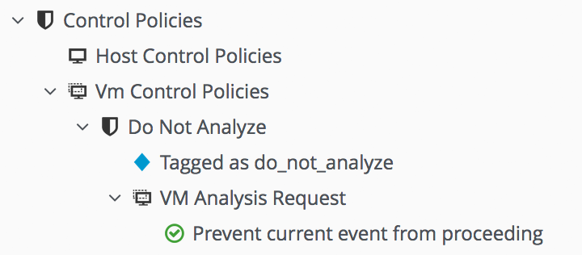
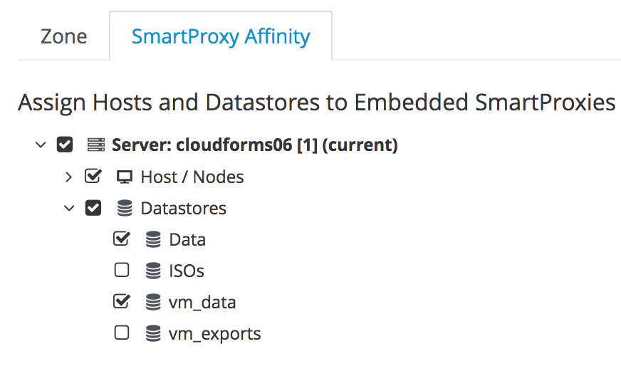

[[smartstate_analysis]]
== SmartState Analysis

SmartState Analysis uses two server roles. The first - _SmartState Analysis_ - is performed by a Generic or Priority worker, depending on message priority. The SmartState Analysis role calls a component called the _JobProxyDispatcher_ to determine the most suitable _Smart Proxy_ server to run the VM scan. Once the scan has completed the SmartState Analysis role saves the scan metadata to the VM’s model, and creates drift history data by comparing the most recent scan with previous results.

The second server role - _SmartProxy_ - enables the embedded or "coresident".footnote:[Earlier versions of CloudForms and ManageIQ supported _external_ Smart Proxies running on Windows servers or VMware ESX hosts. These are no longer required and so have been removed from the product] __MiqSmartProxyWorker__ processes. These workers perform the actual scans of the virtual machines using the following steps: 

* Create a snapshot of the VM
* Analyze the snapshot:
** Mount the VM's disks
** Analyze the content
** Unmount the VM's disks
* Remove the snapshot
* Upload the metadata to temporary storage in the VMDB

=== Provider-Specific Considerations

There are several provider-specific considerations for SmartState Analysis.

==== VMware

The _MiqSmartProxyWorker_ processes scans virtual machines after making an authenticated connection to the ESXi host running the VM. Any CFME appliance in the provider's zone that is running the smart proxy role must also have the VMware Virtual Disk Development Kit (VDDK) installed.footnote:[The procedure to install the VDDK is described in the following Red Hat Knowledge Base article: https://access.redhat.com/articles/2078103]. For the authentication to succeed the credentials for each ESXi hypervisor should be defined against the host properties in the CloudForms WebUI. The credentials should use either _root_, or a VMware account with the following role permissions:

* Datastore
** Browse Datastore
** Low level file operations
* Global
** Diagnostics
** Licenses
* Host
** Configuration
*** Advanced Settings
* Virtual Machine
** Provisioning
*** Allow read-only disk access
** Snapshot Management
*** Create snapshot
*** Remove snapshot

===== Authentication Via vCenter

If it is not possible to add credentials for the ESXi hosts, virtual machine scanning can still be performed using an authentication token provided by the vCenter.

The CloudForms *Configuration->Advanced* settings contain a section entitled `:coresident_miqproxy` that has a value `:scan_via_host`. By default this is set to `true`, but changing the value to `false` and restarting the __MiqSmartProxyWorker__ processes enables vCenter authentication for VM scans.

[NOTE]
====
The name `:scan_via_host` is slightly misleading. Setting this value to `false` only enables VDDK authentication via the vCenter. The actual scan is still performed by the Smart Proxy server connecting directly to the ESXi host using port 902.
====

[source,yaml] 
----
:coresident_miqproxy:
...
  :scan_via_host: false
----  
 
==== Red Hat Enterprise Virtualization

For SmartState Analysis of RHEV virtual machines to complete successfully, the CFME appliances running the SmartProxy server roles must be in the same RHEV datacenter as the VM being scanned. The storage domains much also be accessible to the SmartProxy appliances. Fibre channel or iSCSI storage domains should be presented to each SmartProxy appliance as shareable direct LUNs. NFS datastores must be mountable by each SmartProxy appliance, which may mean adding secondary network interfaces to the CFME appliances, connected to the storage network.

The _management engine relationship_ must also be set for each CFME appliance. This enables the VM SmartState Analysis job to determine the datacenter where the CFME appliance is running and thus to identify which storage it has access to.

==== OpenStack

CloudForms is capable of performing a SmartState Analysis of both Overcloud images, and Undercloud Nova compute nodes.

===== Overcloud

CloudForms is able to perform a SmartState Analysis of Glance-backed OpenStack images. In order to scan a running instance, an image snapshot is taken and copied to the CFME appliance to be scanned (SmartState Analysis requires byte-level offset/length access to images which cannot be performed remotely using the current OpenStack APIs). 

To ensure that this storage area is large enough to receive large image snapshots, any CFME appliance in an OpenStack zone with the SmartProxy role enabled should have its temporary storage area extended using the following *appliance_console* option:

[source,pypy] 
----
 13) Extend Temporary Storage
----

This option will format an unpartitioned disk attached to the CFME appliance and mount it as _/var/www/miq_tmp_

===== OpenStack Platform Director (Undercloud)

CloudForms is able to perform a SmartState Analysis of OpenStack Platform Director Nova compute nodes. To allow the smart proxy to connect to the Nova hosts, the RSA key pair private key for the hosts should be added to the provider details. The heat-admin user is typically used for host connection.

==== OpenShift

SmartState scanning of OpenShift containers is performed by an __image_inspector__ pod that is pulled from the Red Hat registry as required. The image inspector dynamically downloads and uses the latest OpenScap definition/rules file from Red Hat before scanning.footnote:[Enabling proxy access for the openshift3/image-inspector is described in the following Red Hat Knowledge Base article: https://access.redhat.com/solutions/2915411]

With CloudForms 4.5 the registry and repository are configurable in *Configuration->Advanced* settings, as follows:

[source,yaml] 
----
:ems_kubernetes:
...
  :image_inspector_registry: registry.access.redhat.com
  :image_inspector_repository: openshift3/image-inspector
----

=== Monitoring SmartState Analysis

The total time for each VM scan can be determined from the time duration between the "request_vm_scan" and corresponding "vm_scan_complete" events being processed through automate, as follows:

[source,pypy] 
----
... INFO -- : MIQ(MiqAeEngine.deliver) Delivering {:event_type=>"request_vm_scan", \
"VmOrTemplate::vm"=>39, :vm_id=>39, :host=>nil, "MiqEvent::miq_event"=>20690, \
:miq_event_id=>20690, "EventStream::event_stream"=>20690, \
:event_stream_id=>20690} for object \
[ManageIQ::Providers::Redhat::InfraManager::Vm.39] with state [] to Automate
...
... INFO -- : MIQ(MiqAeEngine.deliver) Delivering {:event_type=>"vm_scan_complete", \
"VmOrTemplate::vm"=>39, :vm_id=>39, :host=>nil, "MiqEvent::miq_event"=>20692, \
:miq_event_id=>20692, "EventStream::event_stream"=>20692, :event_stream_id=>20692} \
for object [ManageIQ::Providers::Redhat::InfraManager::Vm.39] with state [] \
to Automate
----

This time includes the scan pre-processing by the Generic worker, the handoff by the _JobProxyDispatcher_ to the appropriate SmartProxy appliance, and the subsequent scan an data process and upload times.

More granular timings are logged to _evm.log_ and these can be examined if required to determine the source of bottlenecks. For example the time taken for the __MiqSmartProxyWorker__ process to extract each part of the profile is logged, and can be extracted using the following bash command:

[source,bash] 
----
grep 'information ran for' evm.log
----

[source,pypy] 
----
... Scanning [vmconfig] information ran for [0.156029053] seconds. 
... Scanning [accounts] information ran for [0.139248768] seconds. 
... Scanning [software] information ran for [4.357743037] seconds. 
... Scanning [services] information ran for [3.767868137] seconds. 
... Scanning [system] information ran for [0.305050798] seconds. 
... Scanning [profiles] information ran for [0.003027426] seconds. 
----

=== Challenges of Scale

SmartState Analysis is a relatively time-consuming operation per virtual machine. Many of the problems associated with scaling SmartState Analysis are related to performing many hundreds or thousands of analyses in a limited time window.

Periodic scans of a complete VM inventory should be scheduled with a frequency that allows each scan to complete before the next is scheduled. For small installations this is sometimes daily, but larger scale installations often schedule these on a weekly or monthly basis. Control policies can be used to perform initial scans when VMs are first provisioned, so that SmartState data is available for new VMs before a scheduled analysis has been run.

==== Virtual Machines Running Stateful Applications

A virtual machine SmartState Analysis is always performed on a snapshot of the VM. Virtual machine snapshots aren't application aware however, and using them can have unintended and unexpected consequences for some applications that maintain state data such as Microsoft Exchange Server.footnote:[Further information can be found in the following Microsoft Technet article: https://technet.microsoft.com/en-us/library/jj126252%28v=exchg.141%29.aspx?f=255&MSPPError=-2147217396#BKMK_ExchangeStor ]. Virtual machines running such applications should not be SmartState Analyzed.

[NOTE]
====
A SmartState Analysis of the CloudForms VMDB appliance should never be performed 
====

A control policy can be created to prevent SmartState Analysis from running on any VM tagged with "exclusions/do_not_analyze", as shown in <<i10-1>>.

[[i10-1]]
.Control Policy to Block SmartState Analysis

{zwsp} +

Virtual machines running stateful workloads can be tagged accordingly to prevent the snapshot from being taken.

==== Identifying SmartState Analysis Problems

Problems with SmartState Analysis are logged to _evm.log_, and can be identified using the following bash command:

[source,bash] 
----
grep 'VmScan#process_abort' evm.log
----

Many of the most common errors are caused as a result of scaling parts of the infrastructure - hosts or CFME appliances - and forgetting to update the provider-specific considerations for SmartState Analysis.

===== No active SmartProxies found

If the _JobProxyDispatcher_ cannot find a suitable SmartProxy to scan a virtual machine, the error "No active SmartProxies found to analyze this VM" is logged. In VMware environments this is often caused by failing to install the VDDK on a new CFME appliance that has been configured with the SmartProxy server role.

[source,pypy] 
----
... MIQ(VmScan#process_abort) job aborting, No eligible proxies for VM \
:[[NFS_PROD] odrsrv001/odrsrv001.vmx] - [No active SmartProxies found to \
analyze this VM], aborting job [8064001a-e2ea-11e6-9140-005056b19b0f].
----

===== Provide credentials

If a new VMware ESXi hosts's credentials have been omitted from the CloudForms WebUI (or a host's credentials changed), the error "Provide credentials for this VM's Host to perform SmartState Analysis" will be logged if a scan is attempted of a virtual machine running on that host.

[source,pypy] 
----
... MIQ(VmScan#process_abort) job aborting, No eligible proxies for VM \
:[[FCP_MID] osdweb01/osdweb01.vmx] - [Provide credentials for this VM's Host \
to perform SmartState Analysis], aborting job [d2e08e70-c26b-11e6-aaa4-00505695be62].
----

===== Unable to mount filesystem

If a CFME appliance running the SmartProxy server role does not have access to the storage network of a RHEV provider, an attempted scan of a virtual machine on an NFS storage domain will timeout.

[source,pypy] 
----
... MIQ(VmScan#process_abort) job aborting, Unable to mount filesystem. \
Reason:[mount.nfs: Connection timed out
----

=== Tuning SmartState Analysis

SmartState Analysis settings are stored in the `:coresident_miqproxy` section of the *Configuration->Advanced* settings, as follows:

[source,yaml] 
----
:coresident_miqproxy:
  :concurrent_per_ems: 1
  :concurrent_per_host: 1
  :scan_via_host: true
  :use_vim_broker: true
  :use_vim_broker_ems: true
---- 

The default value of `:concurrent_per_host` is 1, which limits the number of concurrent VM scans that can be carried out to any particular host. 

==== Increasing the Number of SmartProxy Workers

The default number of "VM Analysis Collector" (_MiqSmartProxyWorker_) workers per appliance is 3. This can be increased to a maximum of 5, although consideration should be given to the additional CPU and memory requirements that an increased number of workers will place on an appliance. It may be more appropriate to add further appliances and scale horizontally.

CloudForms installations managing several thousand objects may benefit from dedicated CFME appliances in the provider zones exclusively running the SmartState Analysis and SmartProxy roles.

==== SmartProxy Affinity

Hosts and datastores can be can be 'pinned' to specific embedded SmartProxy servers using the *SmartProxy Affinity* setting in the *Configuration -> Settings -> Zones* area of the WebUI, as shown in <<i10-2>>:

[[i10-2]]
.SmartProxy Affinity

{zwsp} +

This can help ensure that only the most optimally placed or suitably configured CFME appliances are used for SmartState Analysis scans.