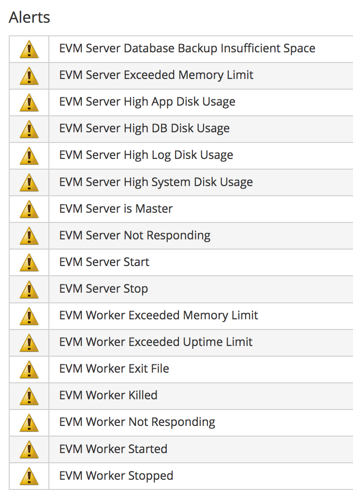

[[monitoring]]
== Monitoring

Monitoring of the various components discussed in this Reference Architecture is essential for maintaining optimum performance of a large CloudForms installation.

As mentioned in <<introduction>> the key to deploying CloudForms at scale is to monitor and tune at each stage of the scaling process. Once confidence has been established that the installation is working optimally at restricted scale, the scope of deployment can be enlarged and the CFME appliances tuned as required to handle the additional workload. 

The VMDB and CFME worker appliances within a region have different monitoring requirements, as described below.

=== Database Appliance

The database appliance can become a performance bottleneck for the CloudForms region if it is not performing optimally. The following items should be regularly monitored:

* VMDB disk space utilization - monitor and forecast when 80% of filesystem will become filled. Track actual disk consumption versus expected consumption
* CPU utilization. A steady state utilization approaching 80% may indicate that VMDB appliance scaling or region redesign is required
* Memory utilization, especially swap usage
** Increase appliance memory if swapping is occurring
* I/O throughput - use the sysstat or iotop tools to monitor I/O utilization, throughput, and I/O wait state processing
* Monitor the miq_queue table
** Number of entries
*** Check for signs of event storm: messages with role = 'event' and class_name = 'EmsEvent'
** Number of messages in a "ready" state
* Check that the maximum number of configured connections is not exceeded
* Ensure that the database maintenance scripts run regularly

=== CFME 'Worker' Appliances

Operational limits for non-VMDB or "worker" appliances are usually established on a per-appliance basis, and depend on the enabled server roles and number of worker processes. The following items are typically monitored:

==== General Appliance

* CPU utilization
* Memory utilization, especially swap usage
** Increase appliance memory if swapping is occurring
* Check for message timeouts

==== Workers

* Review rates and reasons for worker process restarts
** Increase allocated memory if workers are exceeding memory thresholds
* Validate primary/secondary roles for workers in zones and region

===== Provider Refresh

* Review EMS refresh activity, especially full refresh rates 
** How many full refreshes per day?
** How long does a refresh take by provider instance?
*** Data extraction component
*** Database load component
** Are refresh times consistent throughout the day?
*** What is causing periodic slowdowns?
** Are certain property changes triggering too many refreshes?
* Validate the `:full_refresh_threshold` value

===== Capacity & Utilization

* Are any realtime metrics being lost?
** Long message dequeue times
** Missing data samples
* How long does metric collection take?
** Data extraction component
** Database load component
* Are rollups completing in time?
** Confirm expected daily and hourly records for each VM
* Validate numbers of Data Collector and Data Processor workers

===== Automate

* Are any requests staying in a "pending" state for a long time?
** Validate the number of Generic workers
* Check for state machine retries or timeouts exceeded
* Monitor provisioning failures
** Timeouts?
** Internal or external factors?

===== Event Handling

* Monitor utilization of CFME appliances with Event Monitor role enabled
* Validate memory allocated to Event Monitor workers

===== SmartState Analysis

* Monitor utilization of CFME appliances with SmartProxy role enabled when scheduled scans are running
* Review scan failures/aborts
* Validate number of SmartProxy workers

===== Reporting 

* Monitor utilization of appliances with Reporting role enabled when periodic reports are running.
* Validate number of Reporting workers

=== Alerts

Some self-protection policies are available out-of-the-box in the form of alerts. <<i12-1>> shows the alert types that are available. Each is configurable to send an  email, an SNMP trap, or run an automate instance.

[[i12-1]]
.EVM Self-Monitoring Alerts

{zwsp} +

[NOTE]
====
EVM Worker Started and EVM Worker Stopped events are normal occurrences and should not be considered cause for alarm
====

An email sent by one of these alerts will have a subject such as: 

*Alert Triggered: EVM Worker Killed, for (MIQSERVER) cfmesrv06*. 

The email body will contain text such as the following:

[source,pypy] 
----
Alert 'EVM Worker Killed', triggered

Event:  Alert condition met
Entity: (MiqServer) cfmesrv06
----

To determine more information - such as the actual worker type that was killed - it may be necessary to search _evm.log_ on the appliance mentioned.
