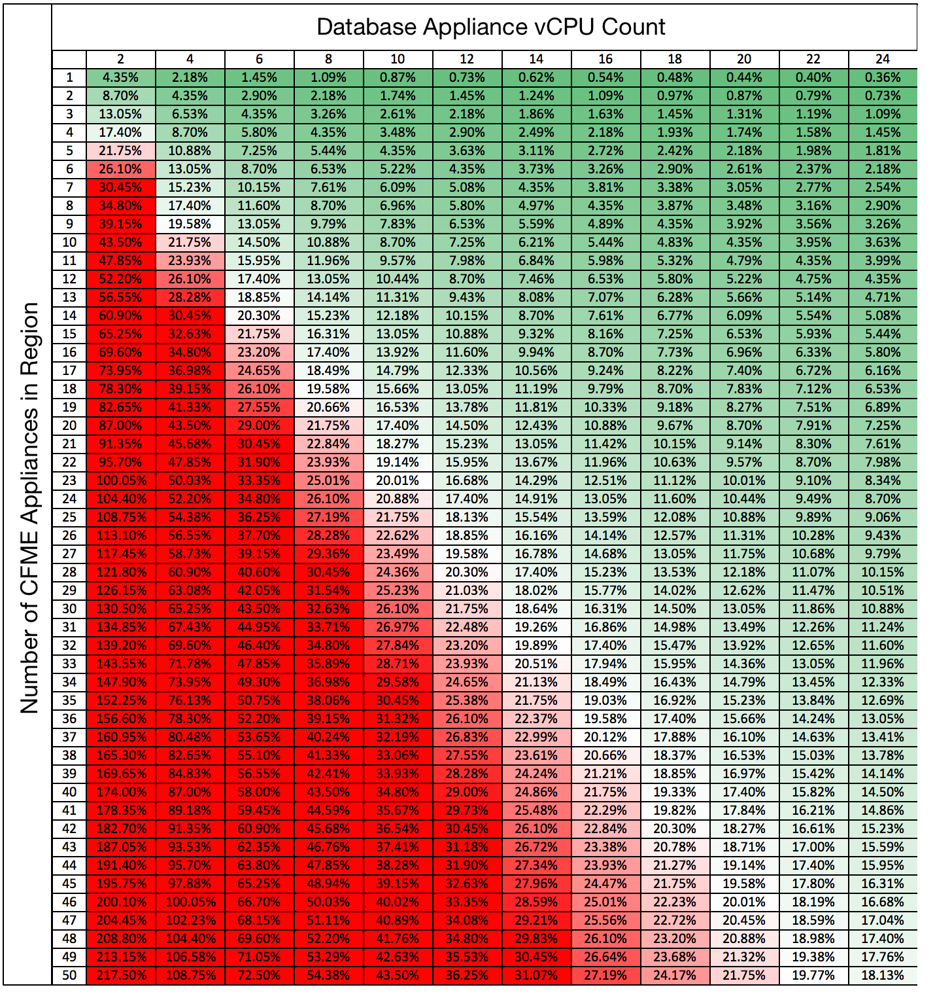

:numbered!:
[appendix]
== Database Appliance CPU Count

The following table shows the anticipated CPU load on the VMDB appliance for a varying number of idle CFME appliances in a region. An average number of 20 worker processes per CFME appliance is assumed, where each worker process creates a single PostgreSQL session. The CPU consumed per idle PostgreSQL session is approximately 0.00435%.

[[ia-1]]
.Database Server CPU Count

{zwsp} +

