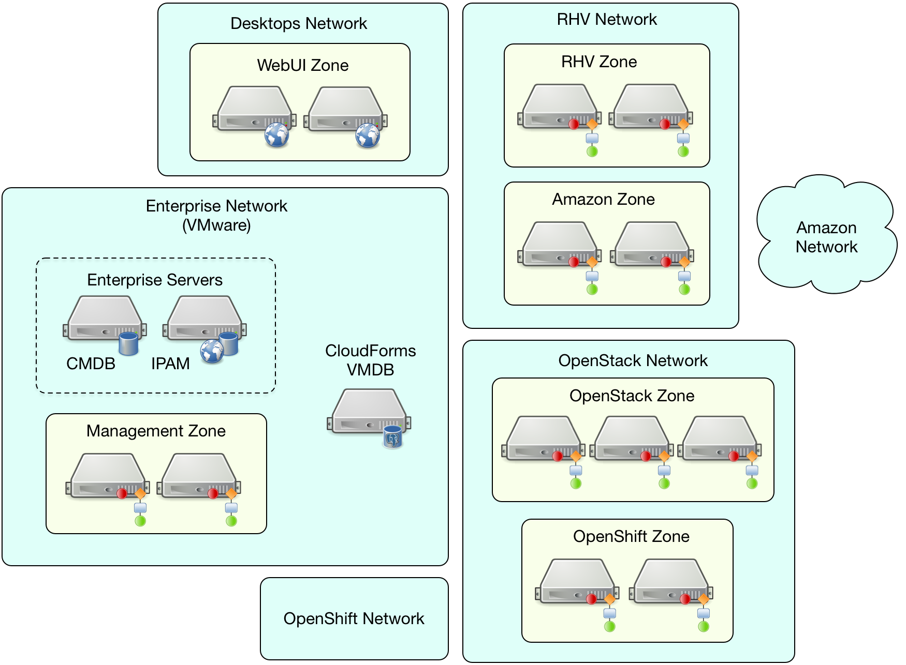

[[design_scenario]]
== Design Scenario

This chapter discusses a hypothetical region and zone design for a new ManageIQ installation, based on the topics discussed in this guide.

=== Environment to be Managed

ManageIQ is to be installed to manage the virtualization and cloud environments used by the Engineering and R&D departments of a large organization. These environments comprise a traditional virtual infrastructure, public and private IaaS clouds, and a container-based PaaS. 

The organization also has a centrally-managed VMware 6.0 environment that hosts many enterprise-wide services such as email, file & print, collaboration, and the Microsoft Active Directory infrastructure. This will not be managed by ManageIQ, although it is available to host ManageIQ appliances if required.

==== Virtual Infrastructure

Red Hat Virtualization 4.0 is installed as the Engineering/R&D virtual infrastructure. It currently comprises 2 clusters, 20 hosts, 10 storage domains and approximately 500 virtual machines. The number of VMs is not expected to grow significantly over the next two years.

==== Private IaaS Cloud

A Red Hat OpenStack Platform 10 private IaaS cloud is installed. This contains approximately 900 images and instances spread between 50 tenant/projects, and also hosts the OpenShift PaaS. An OpenStack Director manages the Undercloud, comprising 42 Nova compute nodes. 

The number of Overcloud instances is forecast to grow by approximately 400 per year over the next two years, giving a projected total of around 1900 managed objects.

==== Public Clouds

A recently acquired subsidiary uses Amazon EC2 for cloud workloads. There are approximately 250 EC2 instances used by two accounts (separate access key IDs), but this number is expected to gradually reduce over the next two years as work is migrated to the OpenStack IaaS. Ansible playbooks are frequently used to configure Amazon EC2 cloud components such as Elastic Load Balancers.

==== PaaS Cloud

A Red Hat OpenShift Container Platform 3.4 PaaS is installed, hosted in OpenStack, and currently comprising approximately 100 nodes, 750 pods and 1000 containers. This number is expected to rise to 300 nodes, 2000 pods and 3500 containers over the next two years.

==== Network Factors

All in-house networking components are split between two campus datacenters. There is LAN-speed (<1MSec) latency between all points on this network. 
For security isolation the Engineering/R&D RHV, OpenStack and OpenShift environments are on separate vLANs, with only limited connectivity to the 'Enterprise' network.

Additional firewall routes into and out of the Enterprise network are possible, but require security change approval.

User workstations are connected to a 'Desktops' network, which has very limited access to servers in the Enterprise or Engineering/R&D networks. User who wish to access the ManageIQ environment must connect to WebUI servers accessible from this Desktops network.

==== Enterprise Integration Points

The Enterprise network hosts common components such as a Configuration Management Database (CMDB) and an IPAM solution, however strict security policies are in place that restrict access to these components from non-Enterprise networks.

Virtual machines provisioned into the Engineering/R&D RHV and OpenStack networks may require registration with one or more of these enterprise tools.

==== Required ManageIQ Functionality

The following capabilities of ManageIQ are required:

* Inventory/Insight of all VMs, instances pods, containers and infrastructure components such as hosts and storage domains
* Rightsizing recommendations for cloud instances
* Reporting
* SmartState Analysis of RHV VMs and OpenShift containers
* Capacity and Utilization metrics for RHV and Amazon EC2
* Service catalog-based provisioning of VMs into RHV and instances into OpenStack.

The rightsizing calculation process uses metrics gathered by C&U, so this must also be enabled for cloud providers.

=== Design Process

The design process usually starts with sizing the region. How many VMs and containers will be managed in total, projected for the next 1-2 years? For this design scenario the projected number of objects to be managed over the next 2 years is shown in <<provider_object_numbers>>

[[provider_object_numbers]]
.Provider Object Numbers - 2 Year Projection
[width="50%",cols="^25%,^25%",options="header",align="center"]
|=======
|Provider|Number of objects
|RHV|600
|OpenStack|1900
|OpenShift|5800
|Amazon EC2|200
|Total|8500
|=======

Based on the maximum suggested region sizes shown in <<guidelines_for_maximum_region_size>>, it can be estimated that a single region will be required, although this region will be large and require careful database tuning.

==== Network Latency

Latency from worker appliance to VMDB should be LAN speed, around 1ms or less. This will dictate where the VMDB appliance should be situated, and also the optimum location of the worker ManageIQ appliances. For this design network latency is good, so the VMDB server should be placed in the most centrally accessible location.

==== VMDB Server

The optimum VMDB server for this design will be a ManageIQ appliance configured as a standalone PostgreSQL server. Although database high availability (HA) has not been specified as an initial requirement, installing a standalone database appliance allows for HA to be configured in future if required. 

The database server will be installed in the Enterprise network, hosted by the VMware 6.0 virtual infrastructure. The estimated size of the database after two years, based on the formula presented in <<database_sizing_and_optimization>> is approximately 468 GBytes. To allow for unexpected growth and a margin of uncertainty, a 750 GByte disk will be presented from a datastore backed by fast FC SAN storage, and used as the database volume.

The database server will have 8 GBytes memory, and a PostgreSQL shared_buffers region of 2 GBytes. A 2 GByte hugepage region will be created for PostgreSQL to use.

The planned zone design contains 13 ManageIQ appliances. Referring to the table in <<appendix_a>> shows that the database server will need 6 vCPUs to maintain an idle CPU load under 20%.

The database maintenance scripts will be enabled on the VMDB server.

==== Zones

A zone should be created per provider (unless the EMS only manages a small number of systems; around 100 VMs or so). There should be a minimum of 2 ManageIQ appliances per zone for resilience, and zones should not span networks.

For this design scenario the following zones are proposed.

==== WebUI Zone

A WebUI zone will be created that contains 2 ManageIQ appliances, each running the following server roles:

* Automation Engine (to process zone events)
* Provider Operations (because VM provisioning services are used)
* Reporting (if logged-on users will be running their own reports)
* User Interface
* Web Services
* Websocket

The ManageIQ appliances in this zone will be hosted by the enterprise VMware 6.0 environment, in a vLAN accessible from user workstations. User access to them will be via a hardware load-balancer and common Fully-Qualified Domain Name.

==== Management Zone

A Management zone will be created that contains 2 ManageIQ appliances, each running the following server roles:

* Automation Engine
* Provider Operations
* Reporting (for scheduled reports)
* Database Operations
* Notifier
* Scheduler
* Git Repositories Owner
* User Interface
* Web Services
* Websocket

The ManageIQ appliances in this zone will be hosted by the enterprise VMware 6.0 environment. The zone will not contain any providers, but automate workflows that interact with the CMDB and IPAM solutions will run in this zone.

==== RHV Zone

The RHV zone will contain approximately 600 managed objects. The table <<guidelines_for_appliance_to_object_ratios>> suggests that 2 appliances should be sufficient, each running the following server roles:

* Automation Engine
* 3 x C&U roles
* Provider Inventory
* Provider Operations
* Event Monitor
* SmartProxy
* SmartState Analysis
* Git Repositories Owner
* User Interface
* Web Services
* Websocket

The ManageIQ appliances in this zone will be hosted by the RHV environment, and so firewall ports must be opened to allow these appliances to connect to the VMDB server in the Enterprise network. The RHV provider will be in this zone.

==== OpenStack zone

The OpenStack zone will initially contain approximately 900 instances (for example instances, images, tenants,or networks), increasing to 1700 in two years time. The table <<guidelines_for_appliance_to_object_ratios>> suggests that 3 appliances should be sufficient initially, each running the following server roles:

* Automation Engine
* 3 x C&U roles
* Provider Inventory
* Provider Operations
* Event Monitor
* Git Repositories Owner
* User Interface
* Web Services
* Websocket

The ManageIQ appliances in this zone will be hosted by the OpenStack environment, and so firewall ports must be opened and routes created to allow these appliances to connect to the VMDB server in the Enterprise network, and to the OpenStack Director. Both OpenStack Cloud and Infrastructure Manager (Undercloud) providers will be in this zone.

Further appliances will need to be added to this zone as the number of managed objects increases.

==== OpenShift Zone

The OpenShift zone will contain approximately 800 managed objects. The table <<guidelines_for_appliance_to_object_ratios>> suggests that 2 appliances should be sufficient initially, each running the following server roles:

* Automation Engine
* 3 x C&U roles
* Provider Inventory
* Provider Operations
* Event Monitor
* SmartProxy
* SmartState Analysis
* Git Repositories Owner
* User Interface
* Web Services
* Websocket

The ManageIQ appliances in this zone will also be hosted by the OpenStack environment, and so firewall ports must be opened and routes created to allow these appliances to connect to the VMDB server in the Enterprise network, and to the OpenShift master. The OpenShift provider will be in this zone.

Further appliances will need to be added to this zone as the number of managed objects increases.

==== Amazon EC2 Zone

The Amazon zone will contain approximately 250 managed objects. The table <<guidelines_for_appliance_to_object_ratios>> suggests that 1 appliance should be sufficient, however for resilience and load balancing 2 will be installed, each running the following server roles:

* Automation Engine
* 3 x C&U roles
* Embedded Ansible
* Provider Inventory
* Provider Operations
* Event Monitor
* Git Repositories Owner
* User Interface
* Web Services
* Websocket

The ManageIQ appliances in this zone will be hosted on a separate vLAN in the RHV environment, and so firewall ports must be opened to allow these appliances to connect to the VMDB server in the Enterprise network, and to the Amazon EC2 network. The Embedded Ansible role will be enabled on these ManageIQ appliances so that Ansible playbooks can be run from service catalogs. The Amazon EC2 providers for both accounts will be in this zone.

The proposed zone design is shown in <<a1-1>>.

[[a1-1]]
.Networks and Zones

{zwsp} +

=== Initial Deployment

The initial deployment and configuration of ManageIQ appliances will be made without enabling the C&U or SmartState Analysis roles on any server. This allows the baseline VMDB database server load to be established over a period of several days from purely EMS refresh activity, and allow an initial RHV `:full_refresh_threshold` to be calculated.

Once the initial performance baselines have been established (and any associated tuning performed), the remaining roles can be enabled. Ongoing monitoring at this stage is important, as this will help fine-tune the number and configuration of worker processes, ManageIQ appliance vCPU and memory sizes, and database configuration parameters.

=== Provisioning Workflow

The VM provisioning workflow (which will run in an automation engine in one of the provider zones) will require the services of the CMDB and IPAM servers that are only accessible from the Enterprise network. The workflow can be customised to use the techniques discussed in <<automate>> and <<provisioning>> to launch new child automation requests using `$evm.execute(create_automation_request,...)` at each of the *AcquireIPAddress* and *RegisterCMDB* states of the VM provision state machine.

The `:miq_zone` option for `create_automation_request` will specify the Management zone as the target zone in which to run the request. Newly inserted states *CheckIPAddressAcquired* and *CheckCMDBUpdated* will use check-and retry logic to determine completion of the child requests.