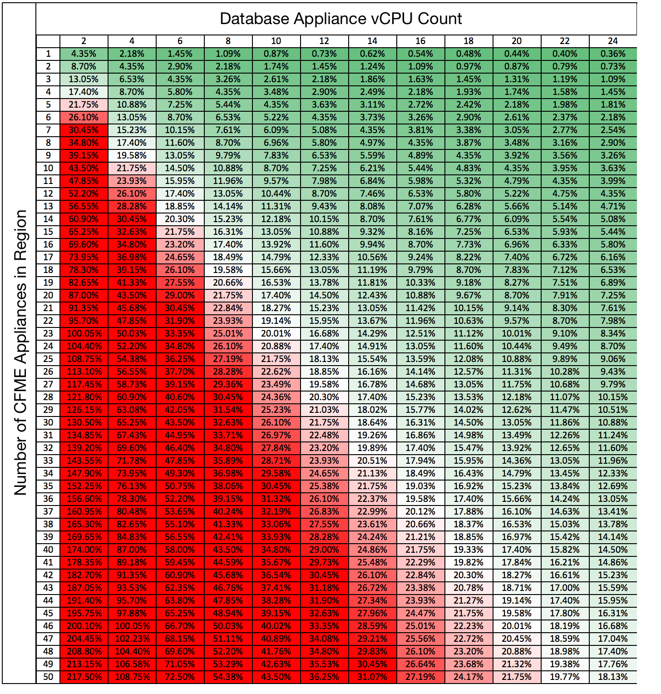

:numbered!:
[[appendix_a]]
[appendix]
== Database Appliance CPU Count

The following table shows the anticipated CPU load on the VMDB appliance for a varying number of idle ManageIQ appliances in a region. An average number of 20 worker processes per ManageIQ appliance is assumed, where each worker process creates a single PostgreSQL session. The CPU consumed per idle PostgreSQL session is approximately 0.00435%.

[[ia-1]]
.Database Server CPU Count

{zwsp} +

[appendix]
== Contributors

|===
| *Contributor*|*Title*|*Contribution*                              
| Peter McGowan|Principal Software Engineer|Author
| Tom Hennessy|Principal Software Engineer|Content, Review
| Bill Helgeson|Principal Domain Architect|Content
| Brett Thurber|Engineering Manager|Review
| Christian Jung|Senior Specialist Solution Architect|Review
| Chandler Wilkerson|Senior Software Engineer|Review
|===
