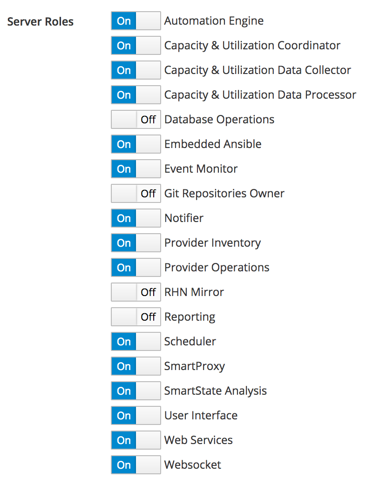
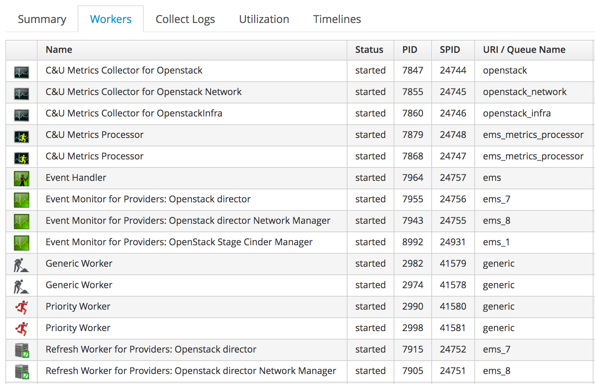
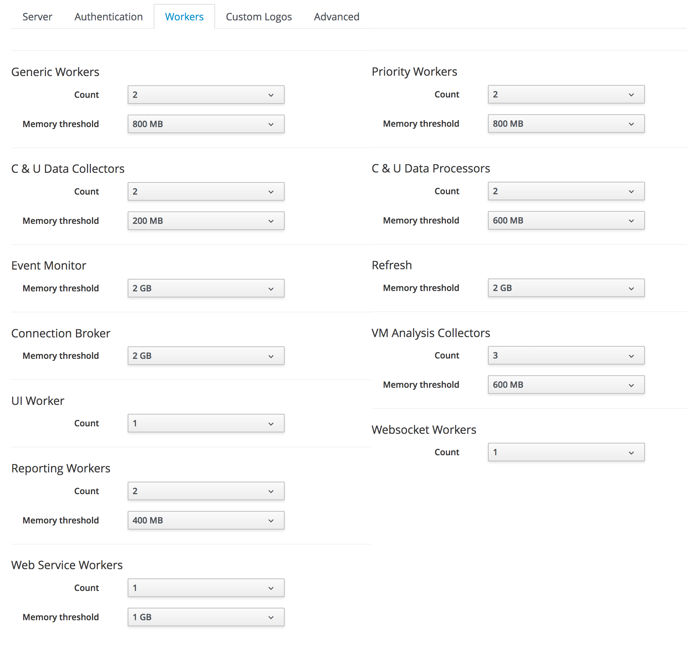

[[architecture]]
== Architecture

In order to understand how to deploy CloudForms at scale, it is important to understand the architectural components that affect the design and deployment decisions. These principal components are described in this chapter.

=== Appliances

To simplify installation, CloudForms Management Engine (CFME) is distributed as fully installed virtual machine template. CFME virtual machines created from these templates are often referred to as _appliances_, and an appliance template comes pre-configured with all required components. A CFME 5.8 appliance runs Red Hat Enterprise Linux 7.x, with PostgreSQL 9.x, Rails 5.0.x, the CloudForms evmserverd service, and all associated Ruby gems installed. 

The self-contained nature of appliances makes them ideal for horizontally scaling a CloudForms deployment to handle the increased load that larger clouds or virtual infrastructures present. 

Appliances are downloadable as images or templates in formats suitable for VMware, Red Hat Enterprise Virtualization, OpenStack, Amazon EC2, Microsoft's System Center Virtual Machine Manager or Azure cloud, and Google Compute Engine. CFME 5.6 and later can also be installed as a Docker container image as a technology preview.

=== Database

A CloudForms region stores all of its data in a PostgreSQL 9.5 database. This is known as the _VMDB_, although the term "database" and "VMDB" are often used interchangeably. The database can be internal and integral with an appliance running several other roles (typical for smaller CloudForms deployments), but for larger CloudForms deployments it is typically a dedicated database server or cluster configured for high availability and disaster recovery.

=== Application

CloudForms is a Ruby on Rails application. The main __miq_server.rb__ Rails application is supported by a number of worker processes that perform the various interactions with managed systems, or collect and analyse data.

=== Providers

CloudForms manages each cloud, container or virtual environment using modular subcomponents called providers. Each provider contains the classes and modules required to connect to and manage its specific target platform, and this provider specialisation enables common functionality to be abstracted by provider type or class. CloudForms acts as a "manager of managers", and in keeping with this concept, providers communicate with their respective underlying cloud or infrastructure platform manager (such as vCenter server or RHV-M) using the native APIs published for the platform manager. A provider's platform manager is often referred to as an External Management System or EMS.

Providers are broadly divided into categories, and in CloudForms 4.5 these are Cloud, Infrastructure, Container, Configuration Management, Network, Middleware and Storage.

==== Cloud Providers

CloudForms 4.5 supports three public cloud providers: Amazon EC2, Google Compute Engine, and Microsoft Azure. There is also a cloud provider that can connect to and manage a private or on-premise Red Hat OpenStack Platform (OSP) cloud (this is the OverCloud in the case that OSP is managed by the Red Hat OpenStack Platform Director). 

==== Infrastructure Providers

CloudForms 4.5 supports three traditional infrastructure providers: VMware vCenter Server, Red Hat (Enterprise) Virtualization Manager, and Microsoft System Center Virtual Machine Manager. There is also an infrastructure provider that can connect to and manage a private or on-premise Red Hat OpenStack Platform Director UnderCloud.

==== Container Providers

CloudForms 4.5 supports OpenShift Container Platform as a Docker container manager

==== Configuration Management Providers

CloudForms 4.5 supports two configuration management providers: Red Hat Satellite and Ansible Tower. The Satellite provider exposes the Foreman host groups to CloudForms, and extends the provisioning capability to include bare-metal (i.e. non-virtual) servers. The Ansible Tower provider allows Ansible jobs to be run as part of an Automate workflow.

==== Network Providers

CloudForms 4.5 supports network providers that allow the visualisation and management of the software-defined network components for Amazon EC2, Google Compute Engine, Microsoft Azure, or OpenStack clouds. Network providers are automatically configured when any of the public or private cloud providers, or OSP Director infrastructure provider are added.

==== Storage Providers

Storage providers allow CloudForms to manage the software-defined storage components in an OpenStack cloud. CloudForms 4.5 has introduced support for the OpenStack Cinder (block) and Swift (object) storage modules.

==== Middleware Providers

CloudForms 4.2 introduced a new Middleware provider type as a technology preview. This provides inventory, metrics and events for JBoss application servers and EAP databases, by connecting to a suitably configured Hawkular instance.

==== Provider Namespaces

Many provider components are named according to a name-spacing schema that follows the style of:

 ManageIQ::Providers::<ProviderName>::<ProviderCategory>

Some examples of this are as follows:

* ManageIQ::Providers::AnsibleTower::ConfigurationManager
* ManageIQ::Providers::OpenshiftEnterprise::ContainerManager
* ManageIQ::Providers::Openstack::CloudManager
* ManageIQ::Providers::Openstack::InfraManager
* ManageIQ::Providers::Azure::NetworkManager
* ManageIQ::Providers::StorageManager::CinderManager
* ManageIQ::Providers::Vmware::InfraManager

=== Server Roles

A CloudForms Management Engine 5.8 appliance can be configured to run up to 19 different server roles. These are enabled or disabled in the server *Configuration* section of the WebUI (see <<i2-1>>).

[[i2-1]]
.Server Roles

{zwsp} +

Roles are implemented by worker processes, many of which communicate via messages. The roles are described as follows:

==== Automation Engine

The _automation engine_ role enables the CFME appliance to handle automation tasks, which includes the processing of events. There should be at least one CFME appliance with this role set in each zone. This role does not have a dedicated worker, automate tasks are processed by either a _MiqGenericWorker_ or a _MiqPriorityWorker_, depending on priority.

==== Capacity and Utilization

Capacity and utilization (C&U) metrics processing is a relatively resource-intensive operation, and there are three roles associated with its operation.

* The _capacity & utilization coordinator_ role acts as a scheduler for the collection of C&U data in a zone, and queues work for the capacity and ctilization data collector. If more than one CFME appliance in a zone has this role, only one will be active at a time. This role does not have a dedicated worker, the C&U coordinator tasks are processed by either a _MiqGenericWorker_ or a _MiqPriorityWorker_, depending on priority.

* The _capacity & utilization data collector_ performs the actual collection of C&U data. This role has a dedicated worker, and there can be more than one CFME appliance with this role in a zone. Setting this role starts the provider-specific data collector workers for any providers in the appliance's zone. For example a CFME appliance in a zone configured with a RHEV provider would contain the _ManageIQ::Providers::Redhat::InfraManager::MetricsCollectorWorker_ process if the C&U data collector server role was enabled.. 

* The _capacity & utilization data processor_ processes all of the data collected, allowing CloudForms to create charts, display utilization statistics, etc.. This role has a dedicated worker called the _MiqEmsMetricsProcessorWorker_. There can be more than one CFME appliance with this role in a zone. 

==== Database Operations

The _database operations_ role enables the CFME appliance to run certain database maintenance tasks such as purging old metrics. This role does not have a dedicated worker, the database operations tasks are processed by a _MiqGenericWorker_.

==== Embedded Ansible

The _embedded ansible_ role enables the use of the built-in Ansible manager, which allows service catalog items of type _Ansible Playbook_ to be created and run. This role has a dedicated worker called the _EmbeddedAnsibleWorker_, but also enables an event catcher and refresh worker:

* _ManageIQ::Providers::EmbeddedAnsible::AutomationManager::EventCatcher_
* _ManageIQ::Providers::EmbeddedAnsible::AutomationManager::RefreshWorker_ 

==== Event Monitor

The _event monitor_ role is responsible for detecting and processing provider events such as a VM snapshot completing, a cloud instance being created, or a hypervisor rebooting. Enabling the role starts at least 2 workers, one or more provider-specific and one common event handler. 

The provider-specific event catcher maintains a connection to a provider's event source (such as the Google Cloud Pub/Sub API for Google Compute Engine) and detects or 'catches' events and passes them to the generic event handler. An event catcher worker will be started for each provider in the appliance's zone, so a zone containing a VMware provider would contain a _ManageIQ::Providers::Vmware::InfraManager::EventCatcher_ worker. Some cloud providers automatically add several types of manager, and these might each have an event catcher worker. For example enabling the event monitor role on an appliance in an OpenStack Cloud provider zone would start the following event catcher workers:

* _ManageIQ::Providers::Openstack::CloudManager::EventCatcher_
* _ManageIQ::Providers::Openstack::NetworkManager::EventCatcher_ 
* _ManageIQ::Providers::StorageManager::CinderManager::EventCatcher_

The event handler worker, called _MiqEventHandler_, is responsible for feeding the events from all event catchers in the zone into the automation engine's event switchboard for processing.

There should be at least one CFME appliance with the event monitor role set in any zone containing a provider, however if more than one CFME appliance in a zone has this role, only one will be active at a time.

==== Git Repositories Owner

A CFME appliance with the _git repositories owner_ role enabled is responsible for synchronising git repository data from a git source such as Github or Gitlab, and making it available to other appliances in the region that have the automation engine role set. The git repository data is copied to _/var/www/miq/vmdb/data/git_repos/<git_profile_name>/<git_repo_name>_ on the CFME appliance. This role does not have a dedicated worker.

==== Notifier

The _notifier_ role is required if CloudForms _control_ or automate is required to forward SNMP traps to a monitoring system, or to send e-mails. If more than one CFME appliance in a specific region has this role, only one will be active at a time. This role does not have a dedicated worker; notification tasks are processed by either a _MiqGenericWorker_ or a _MiqPriorityWorker_, depending on priority.

==== Provider Inventory

The _provider inventory_ role is responsible for refreshing provider inventory information for all provider objects such as  virtual machines, hosts, clusters, tenants, or orchestration templates. It is also responsible for capturing datastore file lists. If more than one CFME appliance in a specific zone has this role, only one will be active at a time. 

Setting this role starts the provider-specific refresh workers for any providers in the appliance's zone, so a zone containing a RHV provider would contain a _ManageIQ::Providers::Redhat::InfraManager::RefreshWorker_ worker. 

VMware providers add an additional _MiqEmsRefreshCoreWorker_, while cloud providers that add several types of manager would add a worker per manager. For example enabling the Provider Inventory role on an appliance in an Azure provider zone would start the following Refresh workers:

* _ManageIQ::Providers::Azure::CloudManager::RefreshWorker_
* _ManageIQ::Providers::Azure::NetworkManager::RefreshWorker_

==== Provider Operations

A CFME appliance with the _provider operations_ role performs certain managed object operations such as stop, start, suspend, shutdown guest, clone, reconfigure, etc., to provider objects such as VMs. These operations might be initiated from the WebUI, from Automate, or from a REST call. It also handles some storage-specific operations such as creating cloud volume snapshots. More than one CFME appliance can have this role active in a zone. The role does not have a dedicated worker; provider operations tasks are processed by either a _MiqGenericWorker_ or a _MiqPriorityWorker_, depending on priority.

==== RHN Mirror

An appliance with _RHN mirror_ role enabled acts as a server containing a repository with the latest CloudForms RPM packages. This also configures other appliances within the same region to point to the chosen RHN mirror server for updates. This provides a low bandwidth method to update environments with multiple appliances. The role does not have a dedicated worker.

==== Reporting

The _reporting_ role specifies which CFME appliances can generate reports. There should be at least one CFME appliance with this role in any zone where report generation is required, and the role can be active on more than one appliance. Enabling this server role starts one or more _MiqReportingWorker_ workers.

==== Scheduler

The _scheduler_ sends messages to start all scheduled activities such as report generation, database backups, or to retire VMs or services. One server in each region must be assigned this role or scheduled CloudForms events will not occur. If more than one CFME appliance in a specific region has this role, only one will be active at a time. Enabling this server role starts the _MiqScheduleWorker_ worker.

[NOTE]
====
Each appliance also has a schedule worker running but this only handles schedules for its own appliance. For example the local scheduler would manage the schedules for the C&U coordinator role if that role was enabled on an appliance.

The Scheduler role is for region-specific scheduling and is only active on one appliance per region.
====

==== SmartProxy

Enabling the _SmartProxy_ role turns on the embedded SmartProxy on the CFME appliance. The embedded SmartProxy can analyse virtual machines that are registered to a host and templates that are associated with a provider. Enabling this role starts three _MiqSmartProxyWorker_ workers. 

==== SmartState Analysis

The _SmartState Analysis_ role controls which CFME appliances can control SmartState Analyses and process the data from the analysis. There should be at least one of these in each zone that contains a provider. This role does not have a dedicated worker; SmartState tasks are processed by either a _MiqGenericWorker_ or a _MiqPriorityWorker_, depending on priority.

==== User Interface

This role enables access this CFME appliance using the Red Hat CloudForms WebUI console. More than one CFME appliance can have this role in a zone (the default behaviour is to have this role enabled on all appliances). Enabling this server role starts one or more _MiqUiWorker_ workers. 

==== Web Services

This role enables the RESTful Web service API on a CFME appliance. More than one CFME appliance can have this role in a zone. Enabling this server role starts one or more _MiqWebServiceWorker_ workers.

[NOTE]
====
Both the User Interface and Web Services roles must be enabled on a CFME appliance to enable logins to the WebUI
====

==== Websocket

This role enables a CFME appliance to be used as a websocket proxy for the VNC and SPICE HTML5 remote access consoles. It is also used by the new WebUI notification service in CloudForms 4.2. Enabling this server role starts one or more _MiqWebsocketWorker_ workers. 

=== Workers

As can be seen, many of the server roles start worker processes. The currently running worker processes on a CFME appliance can be viewed using the following commands in a root bash shell on an appliance:

 vmdb; bin/rake evm:status

The same information can also be seen in the *Workers* tab of the *Configuration -> Diagnostics* page (see <<i2-2>>).

[[i2-2]]
.Worker Processes

{zwsp} +

In addition to the workers started by enabling a server role, each appliance has by default four workers that handle more generic tasks: two _MiqGenericWorkers_ and two _MiqPriorityWorkers_. The MiqPriorityWorkers handle the processing of the highest priority messages (priority 20) in the _generic_ message queue (see below). 

Generic and Priority workers process tasks for the following server roles:

* Automate
* C&U Coordinator
* Database Operations
* Notifier
* Provider Operations
* SmartState Analysis

==== Worker Validation

Monitoring the health status of workers becomes important as a CloudForms installation is scaled. A server thread called __validate_worker__ checks that workers are alive (they have recently issued a 'heartbeat' ping.footnote:[Worker processes issue a heartbeat ping every 10 seconds]), and are within their time limits and memory thresholds. Some workers such as Refresh and SmartProxy workers have a maximum lifetime of 2 hours to restrict their resource consumption.footnote:[The time limit for Refresh workers sometimes needs to be increased in very large environments where a full refresh can take longer than 2 hours]. If this time limit is exceeded, the validate_worker thread will instruct the worker to exit at the end of its current message processing, and spawn a new replacement. 

The following log line shows an example of the normal timeout processing for a RefreshWorker:

[source,pypy] 
----
INFO -- : MIQ(MiqServer#validate_worker) Worker [ManageIQ::Providers::Vmware::InfraManager::RefreshWorker] with ID: [1000000258651], PID: [17949], GUID: [77362eba-c179-11e6-aaa4-00505695be62] uptime has reached the interval of 7200 seconds, requesting worker to exit
----

The following log line shows an example of an abnormal exit request for a MiqEmsMetricsProcessorWorker that has exceeded its memory threshold (see <<worker_memory_thresholds>>:

[source,pypy] 
----
WARN -- : MIQ(MiqServer#validate_worker) Worker [MiqEmsMetricsProcessorWorker] with ID: [1000000259290], PID: [15553], GUID: [40698326-c18a-11e6-aaa4-00505695be62] process memory usage [598032000] exceeded limit [419430400], requesting worker to exit
----

[TIP]
====
The actions of validate_worker can be examined in _evm.log_ by using the following command:

 grep 'MiqServer#validate_worker' evm.log

Use this command to check for workers exceeding their memory allocation.
====

==== Tuning Workers

It often a requirement to tune the number of per appliance workers and their memory thresholds when CloudForms is deployed to manage larger clouds or virtual infrastructures. This can prevent CPU intensive worker processes from adversely affecting other workers on the same appliance.

[[worker_memory_thresholds]]
===== Worker Memory Thresholds

Each worker type is given an out-of-the-box initial memory threshold. The default values have been chosen to perform well with an 'average' workload, but these sometimes need to be increased, depending on the runtime requirements of the specific CloudForms installation. 

===== Adjusting Worker Settings

The count and maximum memory thresholds for most worker types can be tuned from the CloudForms WebUI, in the *Workers* tab of the *Configuration -> Settings* page for each appliance (see <<i2-3>>).

[[i2-3]]
.Worker Settings

{zwsp} +

For other workers not listed in this page, the memory threshold settings can be tuned (with caution) in the *Configuration->Advanced* settings by directly editing the YAML, for example:

[source,yaml] 
----
:workers:
  :worker_base:
  ... 
    :ui_worker:
      :connection_pool_size: 8
      :memory_threshold: 1.gigabytes
      :nice_delta: 1
      :count: 1
----

==== Worker Task Allocation

Tasks are dispatched to the various workers in one of three ways:

. From a scheduled timer. Some tasks are completely synchronous and predictable, and these are dispatched from a timer. The Schedule worker executes in this way.

. From an asynchronous event. Some tasks are asynchronous but require immediate handling to maintain overall system responsiveness, or to ensure that data is not lost. The following workers listen for such events:

** Event Catcher workers
** WebUI workers 
** Web Services (REST API) workers
** Web Socket workers

. From a message. Asynchronous tasks that are not time-critical are dispatched to workers using a message queue. The following list shows "queue workers" that receive work from queued messages:

** Generic workers
** Priority workers
** Metrics Collector workers
** Metrics Processor workers
** Refresh workers
** Event Handler workers
** SmartProxy workers
** Reporting workers

Many of the queued messages are created by workers dispatching work to other workers. For example the Schedule worker will queue a message for the SmartProxy workers to initiate a SmartState Analysis. An Event Catcher worker will queue a message for an Event Handler worker to process the event. This will in turn queue a message for a Priority worker to process the event through the automate event switchboard.

[TIP]
====
Queue workers process messages in a serial fashion. A worker processes one and only one message at a time.
====

=== Messages

The queue workers receive work instructions from messages, delivered via a VMDB table called __miq_queue__, and modelled by the Rails class MiqQueue. Each queue worker queries the __miq_queue__ table to look for work for any of its roles. If a message is claimed by a worker, the message state is changed from "ready" to "dequeue" and the worker starts processing the message. When the message processing is completed the message state is updated to indicate "ok", "error" or "timeout". Messages that have completed processing are purged on a regular basis. 

==== Message Prefetch

To improve the performance of the messaging system, each CFME appliance prefetches a batch of messages into its local memcache. When a worker looks for work by searching for a "ready" state message, it calls a method __get_message_via_drb__ that transparently searches the prefetched message copies in the memcache. If a suitable message is found, the message's state in the VMDB __miq_queue__ table is changed to "dequeue", and the message is processed by the worker.

==== Message Fields

A message contains a number of fields, but the useful ones to be aware of for troubleshooting purposes are described below.

===== Ident

Each message has an _Ident_ field that specifies the worker type that the message is intended for. Messages with an Ident field of 'generic' can be processed by either MiqGenericWorkers or MiqPriorityWorkers, depending on priority.

===== Role

The message also has a _Role_ field that specifies the server role that the message is intended for. Some workers - the generic and priority workers for example - process the messages for several server roles such as automation engine or provider operations. Workers are aware of the active server roles on their CFME appliance, and only dequeue messages for the enabled server roles.

==== Priority

Messages each have a _Priority_ field such that lower priority messages for the same worker role are processed before higher priority messages (1 = highest, 200 = lowest). For example, priority 90 messages are processed before priority 100 messages regardless of order in which they were created. The default message priority is 100, but tasks that are considered of greater importance are queued using messages with lower priority numbers. These message priorities are generally hard-coded and not customizable.

===== Zone

Each message has a _Zone_ field that specifies the zone that the receiving worker should be a member of in order to dequeue the message. Some messages are created with the zone field empty, which means that the message can be dequeued and processed by the _Ident_ worker type in any zone.

==== Server

Messages have a _Server_ field, which is only used if the message is intended to be processed by a particular CFME appliance. If used, the field specifies the GUID of the target CFME appliance.

===== Timeout

Each message has a _Timeout_ field. If the dispatching worker has not completed the message task in the time specified by the timeout, the worker will be terminated and a new worker spawned in its place.

===== State

The messages have a _State_ field that describes the current processing status of the message (see below).

==== Tracing Messages in evm.log

Message processing is so critical to the overall performance of a CloudForms installation, that understanding how to follow messages in _evm.log_ is an important skill to master when scaling CloudForms. There are generally four stages of message processing that can be followed in the log file. For this example a message will be traced that instructs for the automation engine (role "automate" in queue "generic") to run the method `AutomationTask.execute` on automation task ID 7829. 

===== Stage 1 - Adding a message to the queue. 

A worker (or other Rails process) adds a message to the queue by calling `MiqQueue.put`, passing all associated arguments that the receiving worker needs to process the task. For this example the message should be processed in zone 'RHEV', and has a timeout of 600 seconds (automation tasks typically have a 10 minute time period in which to run). The message priority is 100, indicating that a Generic worker rather than Priority worker should process the message (both workers monitor the "generic" queue). The line from _evm.log_ is as follows:

[source,pypy] 
----
[----] I, [2016-12-14T03:36:37.276270 #4986:11e598c]  INFO -- : Q-task_id([automation_request_6298]) MIQ(MiqQueue.put) Message id: [32425368],  id: [], Zone: [RHEV], Role: [automate], Server: [], Ident: [generic], Target id: [], Instance id: [7829], Task id: [automation_task_7829], Command: [AutomationTask.execute], Timeout: [600], Priority: [100], State: [ready], Deliver On: [], Data: [], Args: []
----

===== Stage 2 - Retrieving a message from the queue. 

A Generic worker calls `get_message_via_drb` to dequeue the next available message. This method searches the prefetched message queue in the memcache for the next available message with a state of "ready". The new message with ID 32425368 is found, so its state is changed to "dequeue" in the database __miq_queue__ table, and the message is dispatched to the worker. The line from _evm.log_ is as follows:

[source,pypy] 
----
[----] I, [2016-12-14T03:36:43.945520 #4986:11e598c]  INFO -- : MIQ(MiqGenericWorker::Runner#get_message_via_drb) Message id: [32425368], MiqWorker id: [260305], Zone: [RHEV], Role: [automate], Server: [], Ident: [generic], Target id: [], Instance id: [7829], Task id: [automation_task_7829], Command: [AutomationTask.execute], Timeout: [600], Priority: [100], State: [dequeue], Deliver On: [], Data: [], Args: [], Dequeued in: [6.698342458] seconds
----

[TIP]
====
The "Dequeued in" value is particularly useful to monitor when scaling CloudForms as this shows the length of time that the message was in the queue before being processed. 
====

===== Stage 3 - Delivering the message to the worker.

The MiqQueue class's `deliver` method writes to _evm.log_ to indicate that the message is being delivered to a worker, and starts the timeout clock for its processing. The line from _evm.log_ is as follows:

[source,pypy] 
----
[----] I, [2016-12-14T03:36:43.945717 #4986:11e598c]  INFO -- : Q-task_id([automation_task_7829]) MIQ(MiqQueue#deliver) Message id: [32425368], Delivering...
----

===== Stage 4 - Message delivered and work is complete.

Once the worker has finished processing the task associated with the message, the MiqQueue class's `delivered` method writes to _evm.log_ to indicate that message processing is complete. The line from _evm.log_ is as follows:

[source,pypy] 
----
[----] I, [2016-12-14T03:37:07.414790 #4986:11e598c]  INFO -- : Q-task_id([automation_task_7829]) MIQ(MiqQueue#delivered) Message id: [32425368], State: [ok], Delivered in [23.469068759] seconds
----

[TIP]
====
The "Delivered in" value is particularly useful to monitor when scaling CloudForms as this shows the time that the worker spent processing the task associated with the message.
====

==== Monitoring Message Queue Status

The overall performance of any multi-appliance CloudForms installation is largely dependant on the timely processing of messages. Fortunately the internal `log_system_status` method writes the queue states to _evm.log_ every 5 minutes, and this information can be used to assess message throughput.  

To find the numbers of messages currently being processed (in state "dequeue") in each zone, use the following bash command:

[source,bash] 
----
grep 'count for state=\["dequeue"\]' evm.log
----

[source,pypy] 
---- 
[----] I, [2016-12-13T07:02:09.744300 #17026:11e598c]  INFO -- : Q-task_id([log_status]) MIQ(MiqServer.log_system_status) [EVM Server (2768)] MiqQueue count for state=["dequeue"] by zone and role: {"RHEV"=>{nil=>1, "automate"=>1, "ems_metrics_coordinator"=>1, "ems_metrics_collector"=>2, "ems_metrics_processor"=>2, "smartproxy"=>1, "smartstate"=>2}, nil=>{"database_owner"=>1}}
---- 

[TIP]
====
Messages that appear to be in state 'dequeue' for longer than their timeout period were 'in-flight' when the worker process running them died or was terminated.  
====

To find the numbers of messages in state "error" in each zone, use the following bash command:

[source,bash] 
----
grep 'count for state=\["error"\]' evm.log
----

[source,pypy] 
---- 
[----] I, [2016-12-13T07:02:09.744475 #17026:11e598c]  INFO -- : Q-task_id([log_status]) MIQ(MiqServer.log_system_status) [EVM Server (2768)] MiqQueue count for state=["error"] by zone and role: {"RHEV"=>{nil=>36}, "default"=>{nil=>16}, "UI Zone"=>{nil=>35}}
---- 

To find the numbers of messages in state "ready" that are waiting to be dequeued in each zone, use the following bash command:

[source,bash] 
----
grep 'count for state=\["ready"\]' evm.log
----

[source,pypy] 
---- 
[----] I, [2016-12-13T07:02:09.744591 #17026:11e598c]  INFO -- : Q-task_id([log_status]) MIQ(MiqServer.log_system_status) [EVM Server (2768)] MiqQueue count for state=["ready"] by zone and role: {"UI Zone"=>{"smartstate"=>15, "smartproxy"=>2, nil=>4}, "default"=>{"automate"=>2, nil=>21, "smartstate"=>1, "smartproxy"=>1}, "RHEV"=>{"automate"=>6, "ems_inventory"=>1, nil=>19, "smartstate"=>2, "ems_metrics_processor"=>1259, "ems_metrics_collector"=>641}}
----

[TIP]
====
The count for "ready" state elements in the MiqQueue table should not be greater than twice the number of managed objects (e.g. hosts, VMs, storages) in the region. A higher number than this is a good indication that the worker count should be increased, or further CFME appliances deployed to handle the additional workload.
====

=== Summary of Roles, Workers and Messages

The following table summarises the server roles, the workers performing the role tasks, the 'Role' field within the messages handled by those workers, whether the role is region or zone based, and the maximum number of concurrent instances of the role in the region or zone..

[width="100%",cols="^18%,^23%,^17%,^15%,^15%",options="header",align="center"]
|=======================================================================
|Role |Worker |Message 'Role' |Region or Zone |Max Concurrent
|Automation Engine |Generic or Priority |automate |Region |unlimited
|C&U Coordinator |Generic or Priority |ems_metrics_coordinator |Zone |1
|C&U Data Collector | provider-specific MetricsCollectorWorker |ems_metrics_collector |Zone |unlimited
|C&U Data Processor | MiqEmsMetricsProcessorWorker |ems_metrics_processor |Zone |unlimited
|Database Operations |Generic or Priority |database_owner |Region |unlimited
|Embedded Ansible |EmbeddedAnsibleWorker |N/A |Region |1
|Event Monitor | MiqEventHandler & provider-specific EventCatchers |event |Zone |1
|Git Repositories Owner |N/A |N/A |Zone |1
|Notifier |Generic or Priority | notifier |Region |1
|Provider Inventory | provider-specific RefreshWorker |ems_inventory |Zone |1
|Provider Operations |Generic or Priority |ems_operations |Zone |unlimited
|RHN Mirror |N/A |N/A |Region |unlimited
|Reporting |MiqReportingWorker |reporting |Region |unlimited 
|Scheduler |MiqScheduleWorker | N/A |Region |1
|SmartProxy |MiqSmartProxyWorker |smartproxy |Zone |unlimited
|SmartState Analysis |Generic or Priority |smartstate |Zone |unlimited
|User Interface |MiqUiWorker |N/A |Region |unlimited
|Web Services |MiqWebServiceWorker |N/A |Region |unlimited
|Web Socket |MiqWebsocketWorker |N/A |Region |unlimited
|=======================================================================