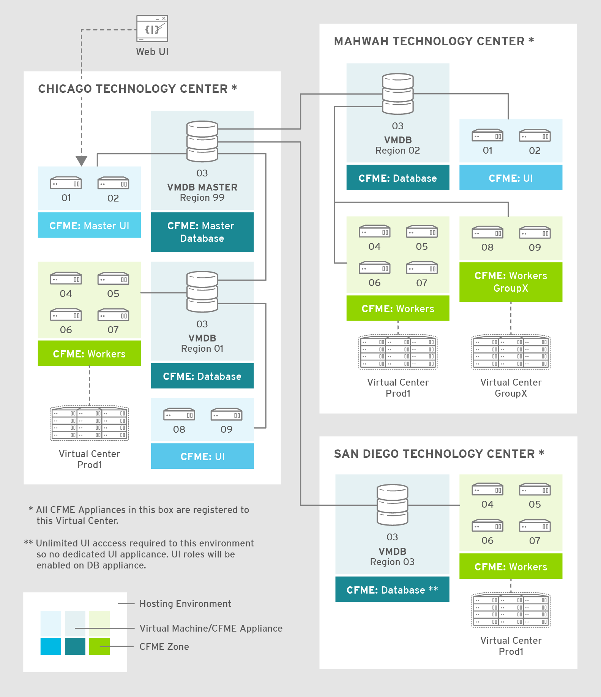

[[regions_and_zones]]
== Region and Zones

When planning a large CloudForms implementation, consideration must be given to the number and size of regions required, and the layout of zones within those regions.footnote:[Regions and zones are described in the CloudForms "Deployment Planning Guide" https://access.redhat.com/documentation/en-us/red_hat_cloudforms/4.2/html/deployment_planning_guide/]. <<i3-1>> shows an example of multiple regions working together in a Red Hat CloudForms environment.

[[i3-1]]
.Regions and Zones

{zwsp} +

In this example the Corporate HQ is located in Chicago Technology Center. This location contains a global "Master" region, and a sub-region that manages the worker appliances. The Mahwah technology center contains a single sub-region that manages two zones. Likewise, the San Diego Technology Center contains a single sub-region managing one zone.

This section describes some of the considerations when designing regions and zones, and presents some guidelines and suggestions for implementation.

=== Regions

A region is a self-contained collection of CloudForms Management Engine (CFME) appliances. Each region has a database - the VMDB - and one or more appliances running the _evmserverd_ service with an associated set of configured worker processes. Regions are often used for organisational or geographical separation of resources, and the choice of region count, location and size is often based on both operational and technical factors.

==== Region Size

All CFME appliances in a region access the same PostgreSQL database, and so the I/O and CPU performance of the database server is a significant factor in determining the maximum size to which a region can grow (in terms of numbers of managed objects) whilst maintaining acceptable performance. 

Database load is determined by many factors including:

* The number of managed objects (VMs, hosts, datastores, etc.) in the region
* The number and type of providers added to the region (for example providers such as VMware or RHV have more out-of-the-box events that can be detected and processed).
* The overall "busyness" of the external management systems (such as vCenters), which determines the rate at which events are received and processed, and thus the rate at which inventory refreshes are requested and loaded.footnote:[With VMware providers relatively minor changes such as VM and Host property updates are detected by the Vim Broker and also cause EMS refreshes to be scheduled] (see <<inventory_refresh>>)
* The frequency of "event storms" (see <<event_handling>>) from the external management systems
* Whether or not Capacity and Utilization (C&U) metric collection is enabled for the region
** Whether this is for all clusters and datastores or a subset of each
** The frequency of collection
* Whether or not SmartState Analysis is enabled for the region
** The frequency of collection
** The amount of data collected in the SmartState Analysis profile
* The complexity of reports and widgets, and frequency of generation 
* The frequency of VM lifecycle operations
** Provisioning
** Retirement
* The frequency of running automate requests and tasks, including service requests
* The number of control or compliance policies in use
* The number of concurrent users accessing the "classic" WebUI, especially displaying large numbers of objects such as VMs
* The frequency and load profile of connections to the RESTful API (including the Self-Service UI)
* The number of CFME appliances (more accurately, worker processes) in the region

With this number of permutations it is very difficult to define a representative load for simulation purposes. Some analysis has been made of existing large CloudForms installations however, and it has been observed that for an "average" mix of the workload factors listed above, an optimally tuned and maintained PostgreSQL server should be able to handle the load from managing up to 5000 VMware objects (VMs, hosts, datastores, etc.). Larger regions than this are possible if the overall database workload is lighter - typically the case for the cloud and container providers - but as with any large database system, performance should be carefully monitored.

[NOTE]
====
A 'global' region is generally capable of handling more objects than this as it has no active providers of its own, and has a lower database load.
====

==== Number of CFME Appliances in a Region

When sizing a region, some thought needs to be given to the number of CloudForms worker processes that are likely to be needed to handle the expected workload, and hence the number of CFME appliances. The workload will depend on the capabilities of the providers that will be configured, and the CloudForms features that are likely to be used. 

Two of the most resource-intensive tasks are those performed by the C&U Data collector and Data Processor workers, particularly where there is a limited time window for the collection of realtime data as there is with VMware or OpenStack providers (see <<capacity_and_utilization>>). It has been established through testing that one C&U Data Collector worker can retrieve and store the metrics from approximately 150 VMware VMs or OpenStack instances in the rolling 60 minute time window that realtime metrics are retained for. As an out-of-the-box CFME appliance is configured with 2 C&U Data Collector workers, it should be able to handle the collection of realtime metrics for 300 VMs. If the number of workers is increased to 4, the appliance could handle the collection of realtime metrics for 600 VMs, although the increased CPU and memory load may adversely affect other processing taking place on the appliance.

Using the 1:300 ratio of CFME appliances to VMs is a convenient starting point for scaling the number of CFME appliances in default configuration required for a region. For regions that will only manage providers with reduced capabilities (such as cloud or container providers), this ratio is often increased to 1:400.

==== Region Design

There are a number of considerations for region design and layout, but the most important are the anticipated number of managed objects (discussed above), and the location of the infrastructure components being managed, or the public cloud endpoints.

===== Centrally Located Infrastructure

With a single, centrally located small or medium sized (i.e. 5000 or fewer managed objects) virtual infrastructure or cloud, the selection of region design is simpler. A single region is usually the most suitable option, with high availability and fault tolerance built into the design.

[NOTE]
====
Large virtual infrastructures can often be split between several regions using multiple sets of provider credentials that have a restricted span-of-control within the entire enterprise.
====

===== Distributed Infrastructure

With a distributed or large infrastructure the most obvious choice of region design might seem to be to allocate a region to each distributed location, however there are a number of advantages to both single and multi-region implementations for distributed infrastructures.

====== Wide Area Network Factors

Network latency between CFME appliances and the database plays a big factor in overall CloudForms "system" responsiveness. There are two utilities supplied on each CFME appliance that can check the latency to a database. The first, db_ping, is designed to check intra-region latency between an existing appliance and its own regional database. The second, db_ping_remote, is designed to check inter-region latency, and so requires external PostgreSQL server details and credentials. The are run as follows:

[source,pypy] 
----
vmdb
tools/db_ping.rb
0.358361 ms
1.058845 ms
0.996966 ms
1.029908 ms
1.048192 ms

Average: 0.898454 ms

tools/db_ping_remote.rb 10.3.0.22 5432 root vmdb_production
Enter the password for database user root on host 10.3.0.22
Password:
0.874407 ms
0.984994 ms
1.040376 ms
1.119602 ms
1.031609 ms

Average: 1.010198 ms
----

[NOTE]
====
On CFME versions prior to 5.8, these tools should be prefixed by `bin/rails runner`, for example:

[source,pypy] 
----
bin/rails runner tools/db_ping.rb
bin/rails runner tools/db_ping_remote.rb
----
====

The architecture of CloudForms assumes LAN-speed latency (≈ 1 ms) between CFME appliances and the database for optimal performance. As latency increases, so overall system responsiveness decreases.

Typical symptoms of a high latency connection are as follows:

* WebUI operations appear to be slow, especially viewing screens that display a large number of objects such as VMs
* Database-intensive actions such as complex report or widget generation take longer to run 
* CFME appliance restarts are slower since the startup seeding acquires an exclusive lock. 
* Worker tasks such as EMS refresh or C&U metrics collection that load data into the VMDB run more slowly
** Longer EMS refreshes may have a detrimental effect on other operations such as VM provisioning.footnote:[discussed in <<provisioning>>]
** Metrics collection might not keep up with the EMS's realtime statistics retention period.footnote:[discussed in <<capacity_and_utilization>>]

When considering deploying a CloudForms region spanning a WAN, it is important to establish acceptable performance criteria for the installation. Although in general a higher latency will result in slower but error-free performance, it has been observed that a latency of 5ms can cause the VMDB update transaction from an EMS refresh to timeout in very large regions. A latency as high as 42 ms can cause failures in database seeding operations.footnote:[See https://bugzilla.redhat.com/show_bug.cgi?id=1422671]

====== Single Region

Where WAN latency is deemed acceptable, the advantages of deploying a single region to manage all objects in a distributed infrastructure are as follows:

* Simplified appliance upgrade procedures (no multiple regions or global region upgrade coordination issues)
* Simplified disaster recovery when there is only one database to manage
* Simpler architectural design, and therefore more straightforward operational procedures and documentation
* Easier to manage the deployment of customisations such as automate code, policies, or reports (there is a single point of import)

====== Multi-Region

The advantages of deploying multiple regions to manage the objects in a distributed infrastructure are as follows:

* Operational resiliency; no single point of failure to cause outage to the entire CloudForms managed environment
* Continuous database maintenance runs faster in a smaller database 
* Database reorganisations (backup & restore) run faster and don't take offline an entire CloudForms installation
* More intuitive alignment between CloudForms WebUI view, and physical and virtual infrastructure
* Reduced dependence on wide-area networking to maintain CloudForms performance
* Region isolation (for performance)
** Infrastructure issues such as event storms that might adversely affect the local region database will not impact any other region
** Customisations can be tested in a development or test region before deploying to a production environment

==== Connecting Regions

As illustrated in <<i3-1>> regions can be linked in such a way that several subordinate regions replicate their object data to a single _global_ region. The global region has no providers of its own, and is typically used for enterprise-wide reporting as it has visibility of all objects. A new feature introduced with CloudForms 4.2 allows some management operations to be performed directly from the global region, utilising a RESTful API connection to the correct child region to perform the action. These operations include the following:

* Virtual machine provisioning
* Service provisioning
* Virtual machine power operations
* Virtual machine retirement
* Virtual machine reconfiguration

==== Region Numbering

Regions have associated with them a region number that is allocated when the VMDB appliance is first initialised. When several regions are linked in a global/subregion hierarchy, all of the region numbers must be unique. Region numbers can be up to three digits long, and the region number is encoded into the leading digits of every object ID in the region. For example for following 3 message IDs are from different regions:

* Message id: [1000000933021]  (region 1)
* Message id: [9900023878436]  (region 99)
* Message id: [398451]  (region 0)

Global regions are often allocated a higher region number (99 is frequently used) to distinguish them from subordinate regions whose numbers often start with 0 and increase as regions are added. There is no technical restriction on region number allocation in a connected multi-region CloudForms deployment, other than uniqueness.

==== Region Summary and Recommendations

The following guidelines can be used when designing a region topology:

* Beware of over-sizing regions. Several slightly smaller interconnected regions will generally perform better than a single very large region
* Network latency from CFME appliances to the VMDB within the region should be close to LAN speed
* Database performance is critical to the overall performance of the region
* All CFME appliances in a region should be NTP synchronized to the same time source
* Identify all external management system (EMS) host or hypervisor instances where steady-state or peak utilization > 50%, and avoid these hosts for placement of CFME appliances, especially the VMDB appliance.

=== Zones

Zones are a way of logically subdividing the resources and worker processing within a region. They perform a number of useful functions, particularly for larger CloudForms installations.

==== Zone Advantages

The following sections describe some of the advantages of implementing zones within a CloudForms region.

===== Provider Isolation

Zones are a convenient way of isolating providers. Each provider has a number of workers associated with it that run on any appliance running the Provider Inventory and Event Monitor roles. These include:

* One Refresh worker
* Two or more Metrics Collector workers
* One Event Catcher
* For VMware:
** One Core Refresh worker
** One Vim Broker

Some types of cloud provider add several sub-provider types, each having their own Event Catchers and/or Refresh workers, and some also having Metrics Collector workers. For example adding a single OpenStack Cloud provider will add the following workers to each appliance with the Provider Inventory and Event Monitor roles:

 * ManageIQ::Providers::Openstack::CloudManager::EventCatcher             
 * ManageIQ::Providers::Openstack::CloudManager::MetricsCollectorWorker (x 2)
 * ManageIQ::Providers::Openstack::CloudManager::RefreshWorker            
 * ManageIQ::Providers::Openstack::NetworkManager::EventCatcher           
 * ManageIQ::Providers::Openstack::NetworkManager::MetricsCollectorWorker (x 2)
 * ManageIQ::Providers::Openstack::NetworkManager::RefreshWorker          
 * ManageIQ::Providers::StorageManager::CinderManager::EventCatcher       
 * ManageIQ::Providers::StorageManager::CinderManager::RefreshWorker      
 * ManageIQ::Providers::StorageManager::SwiftManager::RefreshWorker  

In addition to these provider-specific workers, the two roles add a further two worker types that handle the events and process the metrics for all providers in the zone:

* One Event Handler
* Two or more Metrics Processor workers

Each worker has a minimum startup cost of approximately 250-300MB, and the memory demands of each may vary depending on the number of managed objects for each provider. Having one provider per zone reduces the memory footprint of the workers running on the CFME appliances in the zone, and allows for dedicated per-provider Event Handler and Metrics Processor workers. The prevents an event surge from one provider from adversely affecting the handling of events from another provider, for example.

===== Appliance Maintenance

Shutting down or restarting a CFME appliance in a zone because of upgrade or update is less disruptive if only a single provider is affected.

===== Provider-Specific Appliance Tuning

Zones allow for more predictable and provider-instance-specific sizing of CFME appliances and appliance settings based on the requirement of individual providers. For example small VMware providers can have significantly different resourcing requirements to very large VMware providers, especially for C&U collection and processing. 

===== VMDB Isolation

If the VMDB is running on a CFME appliance (as opposed to a dedicated PostgreSQL appliance), putting the VMDB appliance in its own zone is a convenient way to isolate the appliance from non database-related activities. 

===== Logical Association of Resources

A zone is a natural and intuitive way of associating a provider with a corresponding set of physical or logical resources, either in the same or remote location. For example there might be a requirement to open firewall ports to enable access to a particular provider's EMS on a restricted or remote network. Isolating the specific CFME appliances to their own zone simplifies this task.

[NOTE]
====
Not all worker processes are zone-aware. Some workers process messages originating from or relevant to the entire region
====

===== Improved and Simplified Diagnostics Gathering

Specifying a log depot per zone in *Configuration -> Settings* allows log collection to be initiated for all appliances in the zone, in a single action. When requested, each appliance in the zone is notified to generate and deposit the specified logs into the zone-specific depot.

==== Zone Summary and Recommendations

The following guidelines can be used when designing a zone topology:

* Use a separate zone per provider instance (not provider type)
* Never span a zone across physical boundaries or locations
* Use a minimum of two appliances per zone for resiliency of zone-aware workers and processes
* Isolate the VMDB appliance in its own zone (unless it is a standalone PostgreSQL server)
* At least one CFME appliance in each zone should have the 'Automate Engine' role enabled, to process zone-specific events
** If services will be created that provision VMs using the /ManageIQ/Service/Provisioning/StateMachines/ServiceProvision_Template class, at least once CFME appliance in each zone should have the 'Provider Operations' role enabled to ensure that the service provision request tasks are processed correctly
* Isolating the CFME appliances that general users interact with (running the User Interface and Web Services workers) into their own zone can allow for additional security measure to be taken to protect these servers
** At least one CFME appliance in a WebUI zone should have the 'Reporting' role enabled to ensure that reports interactively scheduled by users are correctly processed (see <<reporting_role>> for more details)
** At least one CFME appliance in a WebUI zone should have the 'Provider Operations' role enabled to ensure that VM provisioning services are run correctly (see <<provider_operations_role>> for more details)
