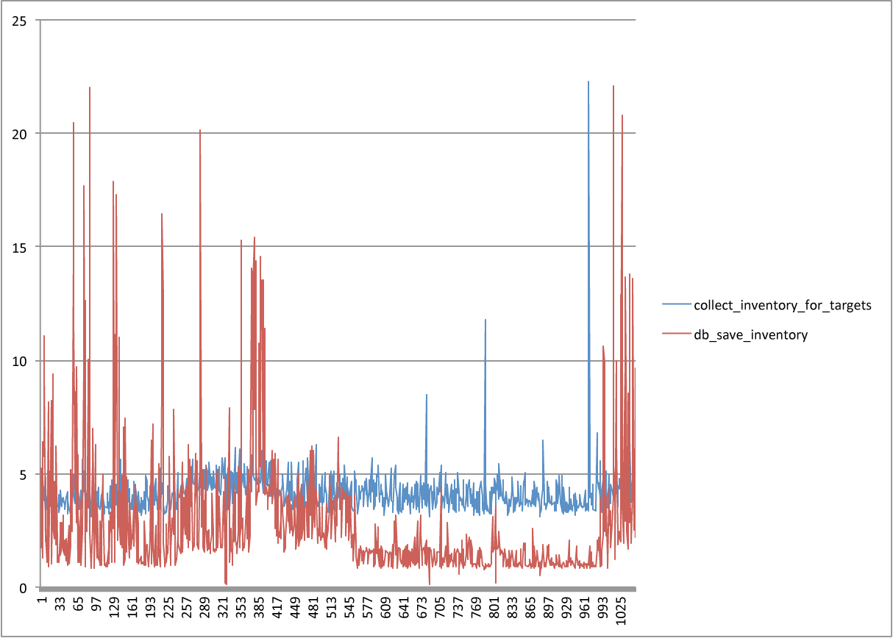

[[inventory_refresh]]
== Inventory Refresh

One of the biggest factors that affects the perceived performance of operations in a large CloudForms installation is the time taken to update the provider inventory in the VMDB. This is known as EMS refresh. There are two types of EMS refresh: a full refresh, where all objects are returned from the provider; and a targeted refresh, where only the details of requested components such as specific VMs or hosts are fetched and processed. In CloudForms 4.2 only the VMware and RH(E)V providers are capable of supporting targeted refreshes; all other providers perform a full refresh.

=== Refresh Overview

Whenever CloudForms is notified of a change related to a managed object, a message is queued either for a refresh of that object (where targeted is supported), or a full EMS refresh. There is never more than one EMS refresh operation in progress for each provider at any one time, with at most one further refresh queued.

If a new refresh is called for, the miq_queue table is first examined to see if a refresh message already exists in the "ready" state for the intended EMS. If no such message already exists, a new one is created. If a message already exists and it is for a full refresh, the new request is ignored, but if the new refresh is targeted and an existing targeted message is found, the new request is merged into the existing message payload, and the message is re-queued. The addition of further targets to a "ready" queued message can happen several times until the message is dequeued.

This action can be observed in _evm.log_. In the following example an EMS refresh was initially queued for a VM with ID 1167. The following log line shows the initial `MiqQueue.put` operation:

[source,pypy] 
----
[----] I, [2016-12-13T04:32:20.746026 #18844:11e598c]  INFO -- : MIQ(MiqQueue.put) Message id: [32170091],  id: [], Zone: [VMware], Role: [ems_inventory], Server: [], Ident: [ems_2], Target id: [], Instance id: [], Task id: [], Command: [EmsRefresh.refresh], Timeout: [7200], Priority: [100], State: [ready], Deliver On: [], Data: [], Args: [[["ManageIQ::Providers::Vmware::InfraManager::Vm", 1167]]]
----

Before this message has been dequeued and processed however, a further EMS refresh request is made for another VM, this time with ID 1241. The following log line shows the `MiqQueue.put_or_update` operation, where the queued message 32170091 is updated with the addition of a second VM in the "Args" field:

[source,pypy] 
----
[----] I, [2016-12-13T04:32:21.053852 #18844:11e598c]  INFO -- : MIQ(MiqQueue.put_or_update) Message id: [32170091],  id: [], Zone: [VMware], Role: [ems_inventory], Server: [], Ident: [ems_2], Target id: [], Instance id: [], Task id: [], Command: [EmsRefresh.refresh], Timeout: [7200], Priority: [100], State: [ready], Deliver On: [], Data: [], Args: [[["ManageIQ::Providers::Vmware::InfraManager::Vm", 1167], ["ManageIQ::Providers::Vmware::InfraManager::Vm", 1241]]], Requeued
----

=== Challenges of Scale

As might be expected, the more managed objects in a virtual infrastructure or cloud, the longer a full refresh takes to complete. The refresh time has a knock-on effect for the process or workflow that initiated the refresh. In some cases this is inconvenient but not critical, such as a delay in seeing a VM's power status change for its WebUI tile icon when it powers on. In other cases - such as provisioning a new VM - a very long EMS refresh may cause the triggering workflow to timeout and exit with an error condition.

=== Monitoring Refresh Performance

An EMS refresh operation has two significant phases that each contribute to the overall performance:

* Extracting and parsing the data from the EMS
** Network latency to the EMS
** Time waiting for the EMS to process the request and return data
** CPU cycles parsing the returned data 
* Updating the inventory in the VMDB
** Network latency to the database
** Database appliance CPU, memory and I/O resources

Fortunately the line printed to _evm.log_ at the completion of the operation contains detailed timings of each stage of the operation, and these can be used to determine bottlenecks.footnote:[Unfortunately the timings are incorrect until https://bugzilla.redhat.com/show_bug.cgi?id=1424716 is fixed. In the meantime the correct times can be calculated by subtracting the previous counter values from the current]. A typical log line is as follows:

[source,pypy] 
----
[----] I, [2017-01-25T03:26:03.380381 #15301:66b14c]  INFO -- : MIQ(ManageIQ::Providers::Vmware::InfraManager::Refresher#refresh) EMS: [CLOUD], id: [1000000000001] Refreshing targets for EMS...Complete - Timings {:server_dequeue=>0.006215572357177734, :get_ems_data=>1.1113097667694092, :get_vc_data=>46.28569030761719, :filter_vc_data=>0.025593042373657227, :get_vc_data_host_scsi=>11.575390100479126, :collect_inventory_for_targets=>59.012681007385254, :parse_vc_data=>0.15207147598266602, :parse_targeted_inventory=>0.15630817413330078, :db_save_inventory=>65.91589498519897, :save_inventory=>65.9160327911377, :ems_refresh=>125.0889003276825}
----

The actual realtime values displayed vary with provider type. All providers report one or more of the following timings:

*  :ems_refresh (the total time to perform the refresh)
*  :collect_inventory_for_targets
*  :parse_targeted_inventory
*  :save_inventory
*  :parse_legacy_inventory

VMware providers additionally report one or more of the following timings:

*  :get_ems_data
*  :get_vc_data
*  :get_vc_data_ems_customization_spec
*  :filter_vc_data
*  :get_vc_data_host_scsi
*  :parse_vc_data
*  :db_save_inventory

RH(E)V providers additionally report one or more of the following timings:

*  :fetch_host_data
*  :fetch_vm_data
*  :fetch_all
*  :parse_inventory

Performing the required calculation.footnote:[Example scripts to perform the calculations are available from https://github.com/pemcg/cfme_log_parsing] on the log line shown above reveals the following performance values:

[source,pypy] 
----
Refresh timings:
  get_ems_data:                        0.032891 seconds
  get_vc_data:                         3.063675 seconds
  filter_vc_data:                      0.000959 seconds
  get_vc_data_host_scsi:               1.047531 seconds
  collect_inventory_for_targets:       4.146032 seconds
  parse_vc_data:                       0.010229 seconds
  parse_targeted_inventory:            0.010285 seconds
  db_save_inventory:                   2.471521 seconds
  save_inventory:                      2.471530 seconds
  ems_refresh:                         6.628097 seconds
----

This shows that the two significant time components to this operation were extracting and parsing the inventory from vCenter (4.146 seconds), and loading the data into the database (2.472 seconds).

=== Identifying Refresh Problems

Refresh problems are best identified by establishing baseline timings when the managed EMS is least busy. To determine the relative EMS collection and database load times, the ':collect_inventory_for_targets' and ':db_save_inventory' timing counters from _evm.log_ can be plotted. For this example the cfme_log_parsing/ems_refresh_timings.rb script is used, as follows:

[source,bash] 
----
ruby ~/git/cfme_log_parsing/ems_refresh_timings.rb -i evm.log -o ems_refresh_timings.out
grep -A 13 "Vm: 1$" ems_refresh_timings.out | grep collect_inventory_for_targets | awk '{print $2}' > collect_inventory_for_targets.txt
grep -A 13 "Vm: 1$" ems_refresh_timings.out | grep db_save_inventory | awk '{print $2}' > db_save_inventory.txt
----

The contents of the two text files can then be plotted, as shown in <<i1>>.

[[i1]]
.Single VM EMS Refresh Component Timings, 24 Hour Period

{zwsp} +

A significant increase or wide variation in data extraction times from this baseline can indicate that the EMS is experiencing high load and not responding quickly to API requests. 

Some variation in database load times throughout a 24 hour period is expected, but sustained periods of long load times can indicate that the database is overloaded.

=== Tuning Refresh

There is little CloudForms tuning that can be done to improve the data extraction time of a refresh. If the extraction times vary significantly throughout the day then some investigation into the performance of the EMS itself may be warranted.

If database load times are high, then CPU, memory and I/O load on the database appliance should be investigated and if necessary tuned. The __top_output.log__ and __vmstat_output.log__ files in _/var/www/miq/vmdb/log_ on the database appliance can be used to correlate the times of high CPU and memory demand against the long database load times.

==== Refresh Threshold

Although targeted refreshes are generally considerably faster than full refreshes, there is a break-even point after which a full refresh becomes more efficient to perform than many tens or hundreds of merged targeted requests. This point unfortunately varies between different CloudForms implementations, and is dependant on the provider EMS type and API responsiveness, VMDB database I/O and CPU performance, and the number of managed objects within each provider.

There is a global setting in the region's configuration YAML (accessible in the WebUI from *Configuration -> Settings -> Server -> Advanced*) called `:full_refresh_threshold`. This specifies the maximum number of concurrent targeted refreshes that should be attempted before being replaced by a single full request, by any provider in the region. 

The `:ems_refresh` section of the *Configuration->Advanced* settings is listed as follows:

[source,yaml] 
----
:ems_refresh:
  :capture_vm_created_on_date: false
  :ec2:
    :get_private_images: true
    :get_shared_images: true
    :get_public_images: false
    :public_images_filters:
    - :name: image-type
      :values:
      - machine
    :ignore_terminated_instances: true
  :ansible_tower_configuration:
    :refresh_interval: 15.minutes
  :foreman_configuration:
    :refresh_interval: 15.minutes
  :foreman_provisioning:
    :refresh_interval: 1.hour
  :full_refresh_threshold: 100
  :hawkular:
    :refresh_interval: 15.minutes
  :kubernetes:
    :refresh_interval: 15.minutes
  :openshift:
    :refresh_interval: 15.minutes
  :openshift_enterprise:
    :refresh_interval: 15.minutes
  :raise_vm_snapshot_complete_if_created_within: 15.minutes
  :refresh_interval: 24.hours
  :scvmm:
    :refresh_interval: 15.minutes
  :vmware_cloud:
    :get_public_images: false
----

As can be seen, the default `:full_refresh_threshold` value is 100, and is provider-independent. The value can however be modified or overridden by provider type. For example to override the setting for all RH(E)V providers in the region, the following lines could be added to the `:ems_refresh` section:

[source,yaml] 
----
  :rhevm:
    :full_refresh_threshold: 200
----

If the full_refresh_threshold value is triggered, there will be a corresponding "Escalating" line written to _evm.log_, for example:

[source,pypy] 
----
[----] I, [2016-12-15T17:25:02.847802 #9386:11e598c]  INFO -- : MIQ(ManageIQ::Providers::Vmware::InfraManager::Refresher#preprocess_targets) Escalating to full refresh for EMS: [vCenter6], id: [1000000000002].
----

Such escalations can happen if too many events are received in a short period of time. Section <<event_handling>> discusses blacklisting events.

===== Calculating a Suitable Refresh Threshold
 
Finding the correct value for the refresh threshold for each CloudForms installation is important. The duration of the refresh process should be as short as possible for several reasons, including the following:

. New VM instances are not recognised until an EMS refresh completes. This can have an adverse impact on other activities such as VM provisioning, where the CheckCompleted state machine stage waits for the newly provisioned VM to be discovered. This state will only wait for a fixed number of 1 minute retries.

. A new EMS refresh operation cannot start until any prior refreshes are completed. If an existing (long) refresh has just missed the creation of a new object but is in progress, a further refresh may be needed to capture the new object.

The optimum value for the refresh threshold can only be found by examining the actual refresh times encountered for each provider. Having multiple providers of the same type in the same region can complicate this process, and if the optimal thresholds for each provider are found to be very different it may be worth splitting providers between regions.

For example a CloudForms installation managing a single VMware provider with approximately 800 VMs was examined to find the optimum refresh threshold. The _evm.log_ file for the CFME appliance with the Provider Inventory role was examined over a period of several days.

It was discovered that that the average time for a targeted EMS refresh for a single VM was approximately 9 seconds, and that this increased by roughly 3 seconds for each additional VM added to the targeted refresh list.

Over the same time period the average time for a full EMS refresh was approximately 225 seconds. A more suitable full_refresh_threshold for this particular installation would therefore be:

[source,pypy] 
----
(225 - 6) / 3 = 73
----