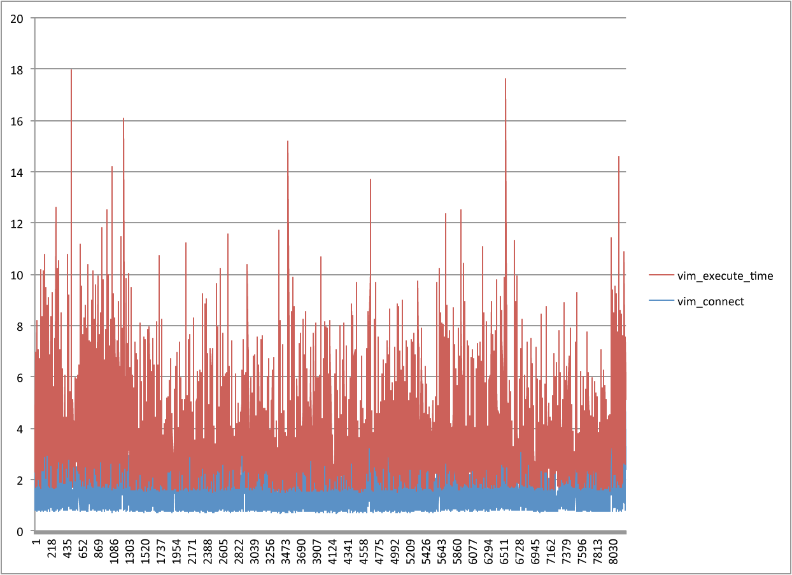
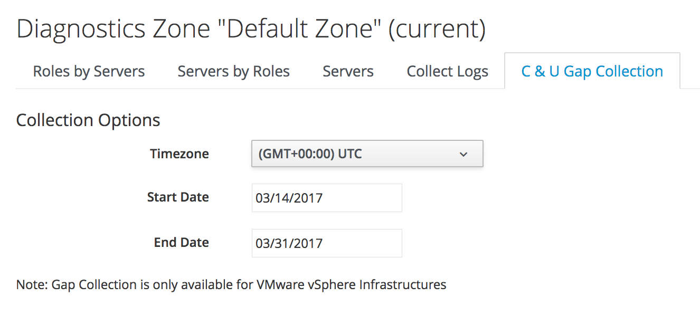

[[capacity_and_utilization]]
== Capacity & Utilization

The processing of Capacity & Utililization (C&U) data is both resource intensive, and with some providers also time critical as real-time counters are only stored for a short period of time. These two factors must be carefully considered and monitored when deploying CloudForms to manage large virtual infrastructures or clouds.

[NOTE]
====
C&U processing is often referred to as _metrics processing_
====

=== Component Parts

As discussed in <<architecture>>, there are three CFME appliance roles connected with C&U processing:

* Capacity & Utilization Coordinator
* Capacity & Utilization Data Collector
* Capacity & Utilization Data Processor

==== C&U Coordination

Every 3 minutes a message is queued for the C&U Coordinator to begin processing.footnote:[The default value is 3 minutes, but this can be changed in 'Advanced' settings]. The Coordinator schedules the data collections for all of the managed objects in the VMDB, and queues messages for the C&U Data Collector to retrieve metrics for any objects for which a collection is due. The default time interval between collections (the _capture threshold_) is 10 minutes, but for VMs, Clusters and Hosts this is expanded to 50 minutes, and for storage, 60 minutes. 

The capture thresholds are defined in the `:performance` section of the *Configuration -> Advanced* settings, as follows:

[source,pypy] 
----
:performance:
  :capture_threshold:
    :default: 10.minutes
    :ems_cluster: 50.minutes
    :host: 50.minutes
    :storage: 60.minutes
    :vm: 50.minutes
  :capture_threshold_with_alerts:
    :default: 1.minutes
    :host: 20.minutes
    :vm: 20.minutes
----

If a control alert is defined for an object type, the shorter capture thresholds defined under `:capture_threshold_with_alerts` are used to ensure a faster response.

The message created by the C&U Coordinator specifies a counter type to retrieve ("realtime" or "hourly"), and an optional time range to collect data for.

==== Data Collection

The data collection phase of C&U processing is split into two parts: capture, and initial processing and storage, both performed by the C&U Data Collector. 

===== Capture

Upon dequeue of a new message the Data Collector makes a connection to the provider's metrics source API to retrieve the data for the object and time range specified in the message. 

The following table shows the metrics sources for the supported providers.

.Metrics Sources
[width="86%",cols="^50%,^50%",options="header",align="center"]
|=======================================================================
|Provider |Metrics source 
|VMware |vCenter Server statistics
|Red Hat Virtualization |  Data Warehouse database (default: ovirt_engine_history)
|OpenStack CloudManager (OSP 6-9) | Ceilometer
|OpenStack CloudManager (OSP 10+) | Gnocchi
|OpenStack InfraManager (Director) | Ceilometer
|Amazon | Amazon CloudWatch
|Azure | Azure Monitor
|Google | Google Cloud Monitoring API (superseded by Stackdriver)
|OpenShift | Hawkular
|=======================================================================

A successful capture is written to _evm.log_, as follows.footnote:[As with the EMS collection timings, the C&U timings are sometimes incorrect until https://bugzilla.redhat.com/show_bug.cgi?id=1424716 is fixed. When incorrect the correct times can be calculated by subtracting the previous counter values from the current]:

[source,pypy] 
----
... MIQ(ManageIQ::Providers::Vmware::InfraManager::Vm#perf_capture) ⏎
[realtime] Capture for ⏎
ManageIQ::Providers::Vmware::InfraManager::Vm name: [VP23911], ⏎
id: [1000000000789]...Complete - Timings: ⏎
{:capture_state=>0.08141517639160156, ⏎
:vim_connect=>0.06982016563415527, ⏎
:capture_intervals=>0.014894962310791016, ⏎
:capture_counters=>0.20465683937072754, ⏎
:build_query_params=>0.0009250640869140625, ⏎
:num_vim_queries=>1, ⏎
:vim_execute_time=>0.2935605049133301, ⏎
:perf_processing=>0.10299563407897949, ⏎
:num_vim_trips=>1, ⏎
:total_time=>0.7732744216918945}
----

===== Initial Processing & Storage

The realtime data retrieved from the metrics source is stored in the VMDB in the _metrics_ table, and in one of 24 sub-tables called __metrics_00__ to __metrics_23__ (based on the timestamp, each table corresponds to an hour). Dividing the records between sub-tables simplifies some of the data processing tasks. Once the data is stored, the Data Collector queues messages to the Data Processor to perform the hourly, daily and parental rollups.

The successful completion of this initial processing stage can be seen in _evm.log_, as follows:

[source,pypy] 
----
... MIQ(ManageIQ::Providers::Vmware::InfraManager::Vm#perf_process) ⏎
[realtime] Processing for ⏎
ManageIQ::Providers::Vmware::InfraManager::Vm name: [VR11357], ⏎
id: [1000000000043], ⏎
for range [2017-01-25T05:59:00Z - 2017-01-25T06:50:20Z]... ⏎
Complete - Timings:  ⏎
{:process_counter_values=>0.019364118576049805, ⏎
:db_find_prev_perfs=>0.015059232711791992, ⏎
:process_perfs=>0.2053236961364746, ⏎
:process_perfs_db=>1.8572983741760254, ⏎
:total_time=>2.1722793579101562}
----

==== Data Processing

The C&U Data Processors periodically perform the task of 'rolling up' the realtime data. Rollups are performed hourly and daily, and counters for more granular objects such as virtual machines are aggregated into the counters for their parent objects. For example for a virtual infrastructure such as VMware or Red Hat Virtualization, the parent rollup process would include the following objects:

VM {hourly,daily} -> Host {realtime,hourly,daily} -> Cluster {hourly,daily} -> Provider {hourly,daily} -> Region {hourly,daily} -> Enterprise

Rollup data is stored in the __metrics_rollups__ table and in one of 12 sub-tables called __metric_rollups_01__ to __metric_rollups_12__ (each table corresponds to a month).

Additional analysis is performed on the hourly rollup data to identify bottlenecks, calculate chargeback metrics, and determine normal operating range and right-size recommendations. The completion of a successful rollup is written to _evm.log_, as follows:

[source,pypy] 
----
... INFO -- : MIQ(ManageIQ::Providers::Vmware::InfraManager::Vm# ⏎
perf_rollup) [hourly] Rollup for ManageIQ::Providers::Vmware:: ⏎
InfraManager::Vm name: [ranj001], id: [1000000000752] for time: ⏎
[2016-12-13T02:00:00Z]...Complete - Timings: ⏎
{:server_dequeue=>0.0035326480865478516, ⏎
:db_find_prev_perf=>3.514737129211426, ⏎
:rollup_perfs=>27.559985399246216, ⏎
:db_update_perf=>7.901974678039551, ⏎
:process_perfs_tag=>1.1872785091400146, ⏎
:process_bottleneck=>2.1828694343566895, ⏎
:total_time=>54.16198229789734}
----

=== Data Retention

Capacity and Utilization data is not retained indefinitely in the VMDB. By default hourly and daily rollup data is kept for 6 months after which it is purged, and realtime data samples are purged after 4 hours. These retention periods for C&U data are defined in the `:performance` section of the *Configuration -> Advanced* settings, as follows:

[source,pypy] 
----
:performance:
  ...
  :history:
    ...
    :keep_daily_performances: 6.months
    :keep_hourly_performances: 6.months
    :keep_realtime_performances: 4.hours
----

=== Challenges of Scale

The challenges of scale for capacity & utilization are related to the time constraints involved when collecting and processing the data for several thousand objects in fixed time periods, for example:

* Retrieving realtime counters before they are deleted from the EMS
* Rolling up the realtime counters before the records are purged from the VMDB
* Inter-worker message timeout

When capacity & utilization is not collecting and processing the data consistently, other CloudForms capabilities that depend on the metrics - such as chargeback or rightsizing - become unreliable.

The challenges are addressed by adding concurrency - scaling out both the data collection and processing workers - and by keeping each step in the process as short as possible to maximise throughput.

=== Monitoring Capacity & Utilization Performance

As with EMS refresh, C&U data collection has two significant phases that each contribute to the overall performance:

* Extracting and parsing the metrics from the EMS
** Network latency to the EMS
** Time waiting for the EMS to process the capture and return data
** CPU cycles performing initial processing 
* Storing the data into the VMDB
** Network latency to the database
** Database appliance CPU, memory and I/O resources

The line printed to _evm.log_ at the completion of each stage of the operation contains detailed timings, and these can be used to determine bottlenecks. The typical log lines for VMware C&U capture and initial processing can be parsed using a script such as perf_process_timings.rb.footnote:[From https://github.com/RHsyseng/cfme-log-parsing], for example:

[source,pypy] 
----
Capture timings:
  build_query_params:                  0.000940 seconds
  vim_connect:                         1.396388 seconds
  capture_state:                       0.038595 seconds
  capture_intervals:                   0.715417 seconds
  capture_counters:                    1.585664 seconds
  vim_execute_time:                    2.039972 seconds
  perf_processing:                     0.044047 seconds
  num_vim_queries:                     1.000000
  num_vim_trips:                       1.000000
Process timings:
  process_counter_values:              0.043278 seconds
  db_find_prev_perfs:                  0.010970 seconds
  process_perfs:                       0.540629 seconds
  process_perfs_db:                    3.387275 seconds
----

C&U data processing is purely a CPU and database-intensive activity. The rollup timings can be extracted from _evm.log_ in a similar manner

[source,pypy] 
----
Rollup timings:
  db_find_prev_perf:                   0.014738
  rollup_perfs:                        0.193929
  db_update_perf:                      0.059067
  process_perfs_tag:                   0.000054
  process_bottleneck:                  0.005456
  total_time:                          0.372196
----

=== Identifying Capacity and Utilization Problems

The detailed information written to _evm.log_ can be used to identify problems with capacity and utilization

==== Coordinator

With a very large number of managed objects the C&U Coordinator becomes unable to create and queue all of the required `perf_capture_realtime` messages within its own message timeout period of 600 seconds. An indeterminate number of managed objects will have no collections scheduled for that time interval. An extraction of lines from _evm.log_ that illustrates the problem is as follows:

[source,pypy] 
----
... INFO -- : MIQ(MiqGenericWorker::Runner#get_message_via_drb) ⏎
Message id: [10000221979280], MiqWorker id: [10000001075231], ⏎
Zone: [OCP], Role: [ems_metrics_coordinator], Server: [], ⏎
Ident: [generic], Target id: [], Instance id: [], Task id: [], ⏎
Command: [Metric::Capture.perf_capture_timer], Timeout: [600], ⏎
Priority: [20], State: [dequeue], Deliver On: [], Data: [], ⏎
Args: [], Dequeued in: [2.425676767] seconds

... INFO -- : MIQ(Metric::Capture.perf_capture_timer) Queueing ⏎
performance capture...

... INFO -- : MIQ(MiqQueue.put) Message id: [10000221979391],  ⏎
id: [], Zone: [OCP], Role: [ems_metrics_collector], Server: [], ⏎
Ident: [openshift_enterprise], Target id: [], ⏎
Instance id: [10000000000113], Task id: [], ⏎
Command: [ManageIQ::Providers::Kubernetes::ContainerManager:: ⏎
ContainerNode.perf_capture_realtime], Timeout: [600], ⏎
Priority: [100], State: [ready], Deliver On: [], Data: [], ⏎
Args: [2017-03-23 20:59:00 UTC, 2017-03-24 18:33:23 UTC]

...

... INFO -- : MIQ(MiqQueue.put) Message id: [10000221990773],  ⏎
id: [], Zone: [OCP], Role: [ems_metrics_collector], Server: [], ⏎
Ident: [openshift_enterprise], Target id: [], ⏎
Instance id: [10000000032703], Task id: [], ⏎
Command: [ManageIQ::Providers::Kubernetes::ContainerManager:: ⏎
ContainerGroup.perf_capture_realtime], Timeout: [600], ⏎
Priority: [100], State: [ready], Deliver On: [], Data: [], ⏎
Args: [2017-03-24 18:10:20 UTC, 2017-03-24 18:43:15 UTC]

... ERROR -- : MIQ(MiqQueue#deliver) Message id: [10000221979280], ⏎
timed out after 600.002976954 seconds.  Timeout threshold [600]
----

Such problems can be detected by looking for message timeouts in the log using a command such as the following:

[source,pypy] 
----
egrep "Message id: \[\d+\], timed out after" evm.log
----

Any lines matched by this search can be traced back using the PID field in the log line to determine the operation that was in process when the message timeout occurred.

==== Data Collection

Some providers keep realtime performance data for a limited time period, and if not retrieved in that time period, it is lost. For example VMware ESXi servers sample performance counter instances for themselves and the virtual machines running on them every 20 seconds, and maintain 180 realtime instance data points for a rolling 60 minute period. Similarly the OpenStack Gnocchi 'low' and 'high' archive policies on OSP 10+ only retain the finest granularity collection points for one hour (although this is configurable). There is therefore a 60 minute window during which performance information for each VMware or OpenStack element must be collected. If the performance data samples are not collected before that rolling 60 minutes is up, the data is lost.

The C&U Coordinator schedules a new VM, host or cluster realtime performance collection 50 minutes after the last data sample was collected for that object. This allows up to 10 minutes for the message to be dequeued and processed, before the realtime metrics are captured. In a large VMware or OpenStack environment the messages for the C&U Data Collectors can take longer than 10 minutes to be dequeued, meaning that some realtime data samples are lost. As the environment grows (more VMs) the problem slowly becomes worse. 

There are several types of log line written to _evm.log_ that can indicate C&U data collection problems.

===== Messages Still Queued from Last C&U Coordinator Run

Before the C&U Coordinator starts queueing new messages it calls an internal method `perf_capture_health_check` that prints the number of capture messages still queued from previous C&U Coordinator schedules. If the C&U Data Collectors are keeping pace with the rate of message additions, there should be approximately 0 messages remaining in the queue when the C&U Coordinator runs. If the C&U Data Collectors are not dequeuing and processing messages quickly enough there will be a backlog.

Searching for the string "perf_capture_health_check" on the CFME appliance with the active C&U Coordinator role will show the state of the queue before the C&U Coordinator adds further messages, and any backlog will be visible.

[source,pypy] 
----
...  INFO -- : MIQ(Metric::Capture.perf_capture_health_check) ⏎
520 "realtime" captures on the queue for zone [VMware Zone] - ⏎
oldest: [2016-12-13T07:14:44Z], recent: [2016-12-13T08:02:32Z]
... INFO -- : MIQ(Metric::Capture.perf_capture_health_check) ⏎
77 "hourly" captures on the queue for zone [VMware Zone] - ⏎
oldest: [2016-12-13T08:02:15Z], recent: [2016-12-13T08:02:17Z]
... INFO -- : MIQ(Metric::Capture.perf_capture_health_check) ⏎
0 "historical" captures on the queue for zone [VMware Zone]
----

===== Long Dequeue Times

Searching for the string "MetricsCollectorWorker::Runner#get_message_via_drb" will show the log lines printed when the C&U Data Collector messages are dequeued. A "Dequeued in" value higher than 600 seconds is likely to result in lost realtime data for VMware or OpenStack providers.

[source,pypy] 
----
... INFO -- : MIQ(ManageIQ::Providers::Vmware::InfraManager:: ⏎
MetricsCollectorWorker::Runner#get_message_via_drb) ⏎
Message id: [1000032258093], MiqWorker id: [1000000120960], ⏎
Zone: [VMware], Role: [ems_metrics_collector], Server: [], ⏎
Ident: [vmware], Target id: [], Instance id: [1000000000060], ⏎
Task id: [], Command: [ManageIQ::Providers::Vmware::InfraManager:: ⏎
Vm.perf_capture_realtime], Timeout: [600], Priority: [100], ⏎
State: [dequeue], Deliver On: [], Data: [], Args: [], ⏎
Dequeued in: [789.95923544] seconds
----

===== Missing Data Samples - Data Collection

Searching for the string "expected to get data" can reveal whether requested data sample points were not available for retrieval from the EMS, as follows:

[source,pypy] 
----
... WARN -- : MIQ(ManageIQ::Providers::Vmware::InfraManager::HostEsx ⏎
#perf_capture) [realtime] For ManageIQ::Providers::Vmware:: ⏎
InfraManager::HostEsx name: [esx04], id: [1000000000023], ⏎
expected to get data as of [2016-12-13T01:20:00Z], ⏎
but got data as of [2016-12-13T02:00:20Z].
----

===== Missing Data Samples - Data Loading

Searching for the string "performance rows...Complete" reveals the number of performance rows that were successfully processed and loaded into the VMDB, as follows:

[source,pypy] 
----
...  INFO -- : MIQ(ManageIQ::Providers::Vmware::InfraManager::Vm# ⏎
perf_process) [realtime] Processing 138 performance rows...Complete ⏎
- Added 138 / Updated 0
----

For VMware this should be less than 180 per collection interval (180 points is the maximum retained for an hour). The presence of a number of lines with a value of 180 usually indicates that some realtime data samples have been lost.

===== Unresponsive Provider

In some cases the CloudForms processes are working as expected, but the provider EMS is overloaded and not responding to API requests. To determine the relative EMS connection and query times for a VMware provider, the ':vim_connect' and ':vim_execute_time' timing counters from _evm.log_ can be plotted. For this example the perf_process_timings.rb script can be used, as follows:

[source,pypy] 
----
ruby ~/git/cfme-log-parsing/perf_process_timings.rb ⏎
-i evm.log -o perf_process_timings.out

egrep -A 22 "Worker PID:\s+10563" perf_process_timings.out | ⏎
grep vim_connect | awk '{print $2}' > vim_connect_times.txt

egrep -A 22 "Worker PID:\s+10563" perf_process_timings.out | ⏎
grep vim_execute_time | awk '{print $2}' > vim_execute_times.txt
----

The contents of the two text files can then be plotted, as shown in <<i6-1>>.

[[i6-1]]
.VMware Provider C&U Connect and Execute Timings, Single Worker, 24 Hour Period

{zwsp} +

In this example the stacked lines show a consistent connect time, and an execute time that is slightly fluctuating but still within acceptable bounds for reliable data collection.

==== Data Processing

The rollup and associated bottleneck and performance processing of the C&U data is less time sensitive, although must still be completed in the 4 hour realtime performance data retention period. 

With a very large number of managed objects and insufficient worker processes, the time taken to process the realtime data can exceed the 4 hour period, meaning that that data is lost. The time taken to process the hourly rollups can exceed an hour, and the rollup process never keeps up with the rate of messages.

The count of messages queued for processing by the Data Processor can be extracted from _evm.log_, as follows:

[source,pypy] 
----
grep 'count for state=\["ready"\]' evm.log | ⏎
egrep -o "\"ems_metrics_processor\"=>[[:digit:]]+"

"ems_metrics_processor"=>16612
"ems_metrics_processor"=>16494
"ems_metrics_processor"=>12073
"ems_metrics_processor"=>12448
"ems_metrics_processor"=>13015
...
----

The "Dequeued in" and "Delivered in" times for messages processed by the MiqEmsMetricsProcessorWorkers can be used as guidelines for overall throughput, for example:

[source,pypy] 
----
... INFO -- : MIQ(MiqEmsMetricsProcessorWorker::Runner# ⏎
get_message_via_drb) Message id: [1000032171247], MiqWorker id: ⏎
[1000000253077], Zone: [VMware], Role: [ems_metrics_processor], ⏎
Server: [], Ident: [ems_metrics_processor], Target id: [], ⏎
Instance id: [1000000001228], Task id: [], ⏎
Command: [ManageIQ::Providers::Vmware::InfraManager::Vm.perf_rollup], ⏎
Timeout: [1800], Priority: [100], State: [dequeue], ⏎
Deliver On: [2016-12-13 03:00:00 UTC], Data: [], ⏎
Args: ["2016-12-13T02:00:00Z", "hourly"], ⏎
Dequeued in: [243.967960013] seconds

... INFO -- : MIQ(MiqQueue#delivered) Message id: [1000032171247], ⏎
State: [ok], ⏎
Delivered in [0.202901147] seconds
----

When C&U is operating correctly, for each time-profile instance there should be one daily record and at least 24 hourly records for each powered-on VM. There should also be at most 5 of the metrics_## tables that contain more than zero records. 

The following SQL query can be used to confirm that the records are being processed correctly:

[source,pypy] 
----
select resource_id, date_trunc('day',timestamp) as collect_date, ⏎
resource_type, capture_interval_name, count(*) 
from metric_rollups
where resource_type like '%Vm%' 
group by resource_id, collect_date, resource_type, capture_interval_name
order by resource_id, collect_date, resource_type, capture_interval_name, count
;
 ..._id | collect_date        | resource_type | capture_int... | count
--------+---------------------+---------------+----------------+-------
...
      4 | 2017-03-17 00:00:00 | VmOrTemplate  | daily          |     1
      4 | 2017-03-17 00:00:00 | VmOrTemplate  | hourly         |    24
      4 | 2017-03-18 00:00:00 | VmOrTemplate  | daily          |     1
      4 | 2017-03-18 00:00:00 | VmOrTemplate  | hourly         |    24
      4 | 2017-03-19 00:00:00 | VmOrTemplate  | daily          |     1
      4 | 2017-03-19 00:00:00 | VmOrTemplate  | hourly         |    24
      4 | 2017-03-20 00:00:00 | VmOrTemplate  | daily          |     1
      4 | 2017-03-20 00:00:00 | VmOrTemplate  | hourly         |    24
...
----

=== Recovering From Capacity and Utilization Problems

If C&U realtime data is not collected it is generally lost. Some historical information is retrievable using C&U gap collection (see <<i6-2>>), but this is of a lower granularity than the realtime metrics that are usually collected. Gap collection is fully supported with VMware providers, but also works in a more limited capacity with some other providers such as OpenShift.

[[i6-2]]
.C&U Gap Collection

{zwsp} +

=== Tuning Capacity and Utilization

Tuning capacity and utilization generally involves ensuring that the VMDB is running optimally, and adding workers and CFME appliances to scale out the processing capability. 

==== Scheduling

Messages for the __ems_metrics_coordinator__ (C&U coordinator) server role are processed by a Generic or Priority worker. These workers also process automation messages, which are often long-running. For larger CloudForms installations it can be beneficial to separate the C&U Coordinator and Automation Engine server roles onto different CFME appliances.

==== Data Collection

The __metrics_00__ to __metrics_23__ VMDB tables have a high rate of insertions and deletions, and benefit from regular reindexing. The database maintenance scripts that can be installed from *appliance_console* run a `/usr/bin/hourly_reindex_metrics_tables` script that reindexes one of the tables every hour. 

If realtime data samples are regularly being lost, there are two remedial measures that can be taken.

===== Increasing the Number of Data Collectors

The default number of C&U Data Collector workers per appliance is 2. This can be increased to a maximum of 9, although consideration should be given to the additional CPU and memory requirements that an increased number of workers will place on an appliance. It may be more appropriate to add further appliances and scale horizontally. 

For larger CloudForms installations it can be beneficial to separate the C&U Data Collector and Automation Engine server roles onto different CFME appliances, as both are resource intensive. Very large CloudForms installations (managing several thousand objects) may benefit from dedicated CFME appliances in the provider zones exclusively running the C&U data collector role.

===== Reducing the Collection Interval

The collection interval can be reduced from 50 minutes to a smaller value (for example 20-30 minutes) allowing more time for collection scheduling and for queuing wait time. The delay or "capture threshold" is defined in the `:performance` section of the *Configuration -> Advanced* settings, as follows:

[source,pypy] 
----
:performance:
  :capture_threshold:
    :ems_cluster: 50.minutes
    :host: 50.minutes
    :storage: 60.minutes
    :vm: 50.minutes
----

Reducing the collection interval places a higher overall load on both the EMS and CloudForms appliances, so this option should be considered with caution. 

==== Data Processing

If C&U data processing is taking too long to process the rollups for all objects, the number of C&U Data Processor workers can be increased from the default of 2 up to a maximum of 4 per appliance. As before, consideration should be given to the additional CPU and memory requirements that an increased number of workers will place on an appliance. Adding further CFME appliances to the zone may be more appropriate.

For larger CloudForms installations it can be beneficial to separate the C&U Data Processor and Automation Engine server roles onto different CFME appliances, as both are resource intensive. CloudForms installations managing several thousand objects may benefit from dedicated CFME appliances in the provider zones exclusively running the C&U Data Processor role.