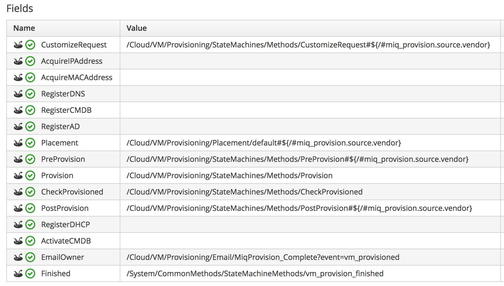
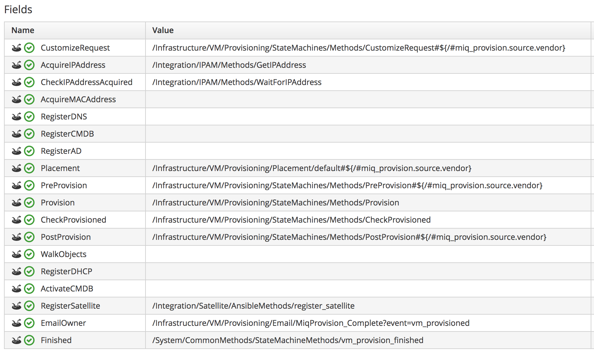

[[provisioning]]
== VM and Instance Provisioning

Although the provisioning workflows for virtual machines and instances are run by the automation engine, there are several provisioning-specific factors that should be considered when deploying CloudForms at scale. 

=== State Machines

The VM provisioning process is one of the most complex automate workflows supplied out-of-the-box with CloudForms. The workflow consists of two nested state machines, the VM provision state machine in the automate datastore, and a provider-specific _internal_ state machine.

==== VM Provision State Machine

The default automate datastore state machine has the fields shown in <<i8-1>>:

[[i8-1]]
.VM Provision State Machine

{zwsp} +

As can be seen, many of the fields are empty "placeholder" states such as *AcquireIPAddress* that can be used to extend the functionality of the state machine and integrate the workflow with the wider enterprise.

==== Internal State Machine

The internal state machine runs asynchronously at the *Provision* state of the VM provision state machine. Internal provision state machines are provider-specific. They perform the granular steps of creating the virtual machine; communicating with the EMS using its native API, and customizing the VM using the parameters defined in the provisioning options hash. A typical set of internal state machine steps to provision a VMware virtual machine are as follows:

* Determine placement
* Start VMware clone from template
* Poll for clone completion
** When complete issue an EMS refresh on the host
* Poll the VMDB for the new object to appear
* Customize the VM 
** Reconfigure hardware if necessary
* Autostart the VM
* Run post-create tasks
** Set description
** Set ownership
** Set retirement
** Set genealogy
** Set miq_custom_attributes
** Set ems_custom_attributes
** Connect to service
* Mark as completed
* Finish

The final state of the internal state machine marks the provision task object as having a state of _provisioned_. The outer VM provision state machine *CheckProvisioned* state polls for this status, and continues to its own *PostProvision* state when detected.

=== Challenges of Scale

The VM or instance provisioning workflow contains several operations that are external to CloudForms, but contribute to overall provisioning time.

* Interactions with the external management system
** EMS API calls from the internal state machine - cloning the template or adding a disk for example
** EMS refresh to retrieve details of the new VM
* Interactions with and time consumed by external provisioning components such as PXE/Kickstart servers
* Interactions with other enterprise systems such as Active Directory, IPAM or a CMDB
* Post-provisioning time consumed by initialization scripts such as cloud-init or sysprep (particularly where this includes a software update of the new virtual machine)

With larger enterprises the number of interactions - and inherent workflow delays - often increases, and CloudForms somtimes needs tuning to cater for this.

==== State Machine Timeouts

As mentioned in <<automate>>, the message to initiate a VM provisioning workflow has a timeout value of 600 seconds. The VM provision state machine therefore has a maximum time of 10 minutes to execute down to the first retry stage, which is *CheckProvisioned*.

===== External Integration

In larger CloudForms deployments it is common to add enterprise integration to the VM provisioning workflow. Custom instances are often added to the placeholder fields such as *AcquireIPAddress* to retrieve an IP address from a corporate IP Address Management (IPAM) solution, for example. If the methods run by these stages take minutes to run under high load, the state machine may timeout before the *CheckProvisioned* state is reached.

To reduce this possibility the VM provision state machine can be expanded to include check-and-retry states after the custom methods, such as the *CheckIPAddressAcquired* state in <<i8-2>>.

[[i8-2]]
.Modified VM Provision State Machine

{zwsp} +

===== Placement

The _/Infrastructure/VM/Provisioning/Placement_ namespace in the _RedHat_ automate domain includes 3 additional placement methods:

* redhat_best_placement_with_scope
* vmware_best_fit_with_scope
* vmware_best_fit_with_tags

These methods perform additional processing to search for an optimum cluster, host and datastore on which to to place the new VM, based on tags or criteria such as most free space, or lowest current CPU utilization. With a large virtual infrastructure containing many hosts and datastores, the real-time checking of these placement permutations can take a long time, and occasionally cause the state machine to timeout.

The placement methods are designed to be user-editable so that alternative criteria can be selected. If the placement methods are taking too long they may need to be edited to simplify the placement criteria.

===== CheckProvisioned

The *CheckProvisioned* state of the VM provision state machine executes a check-and-retry loop until the provisioning task object shows a `state` of 'provisioned' or 'error'. At this point the newly provisioned VM is powered on, and is represented by an object in the CloudForms VMDB. 
The maximum retries for the *CheckProvisioned* state is set at 100, and the default retry interval (set in the __check_provisioned__ method) is as follows:

[source,ruby] 
----
$evm.root['ae_retry_interval'] = '1.minute'
----

When managing very large cloud environments or virtual infrastructures under high load, it can sometimes take longer than 100 minutes for the provisioning steps, related event handling, and EMS refresh to complete. Delays can be caused by many factors, including the following:

* Many other automation messages are queued at the same priority ahead of the provider message for the VM create event
* The message queue is filled with event messages from a provider in the region that is experiencing an event storm
* A prior full refresh is still active
* The provider does not support targeted refresh

The effect of such delays can be minimized by increasing the number of retries in the VM provision state machine for the *CheckProvisioned* state, or by editing the __check_provisioned__ method to increase the retry interval.

=== Tuning Provisioning 

As can be seen, many of the provisioning related problems of scale are related to external factors. Although some fine tuning of timeouts and method optimization can be performed, reliability cannot necessarily be improved by scaling out CloudForms (for example adding CFME appliances, or increasing worker counts).

==== Incubation Region

It can sometimes be beneficial in large virtual environments to create a separate provisioning or _incubation_ CloudForms region that manages a small sub-set of the overall infrastructure. This can be used to provision new virtual machines, which can then be migrated to the production data centers or clusters once they are patched and ready for use.
