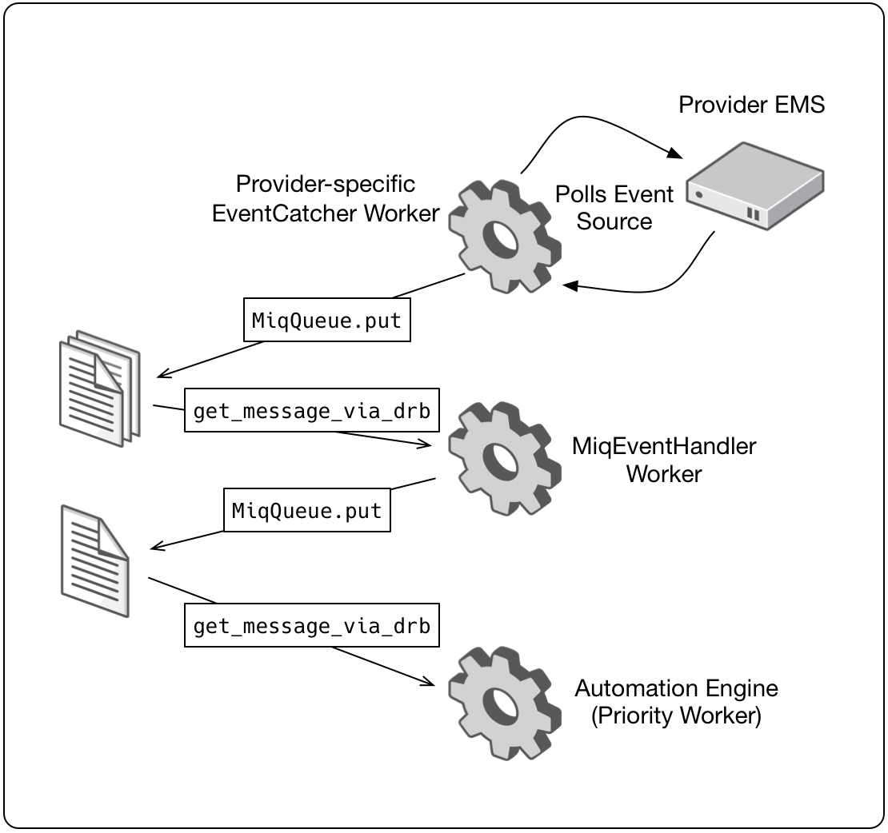

[[event_handling]]
== Event Handling

The timely processing of external and internal events is important to the overall smooth running of a CloudForms installation. This section discusses the event handling process and how it can be tuned for scale.

=== Event Processing Workflow

The event processing workflow involves 3 different workers, as follows:

. A provider-specific event catcher polls the EMS event source for new events using an API call such as `https://rhevm/api/events?from=54316`. For each new event caught a message is queued for the event handler
. The generic _MiqEventHandler_ worker dequeues the message, and creates an _EmsEvent_ EventStream object. Any EMS-specific references such as `:vm=>{:id=>"4e7b66b7-080d-4593-b670-3d6259e47a0f"}` are translated into the equivalent CloudForms object ID such as `"VmOrTemplate::vm"=>1000000000023`, and a new high priority message is queued for automate
. A Priority worker dequeues the message and processes it through the automate event switchboard using the EventStream object created by the _MiqEventHandler_. Processing the event may involve several _event handler_ automate instances that perform actions such as:
** Process any control policies associated with the event
** Process any alarms associated with the event
** Initiate any further operations that are required after the event, such as triggering an EMS refresh

The event workflow is illustrated in <<i9-1>>
 
[[i9-1]]
.Event Processing Workflow

{zwsp} +

=== Generic Events

Some external management systems implement generic event types that are issued under a variety of conditions. They are often used by third-party software vendors as a means to add their own specific events to those of the native EMS. Generic events often have a sub-type associated with them to indicate a more specific event source. 

==== EventEx

VMware vCenter management systems use an event type called _EventEx_ as a catch-all event. Several VMware components issue EventEx events with a subtype to record state changes, problems, and recovery from problems. They appear as `[EventEx]-[subtype]`, for example: 

* [EventEx]-[com.vmware.vc.VmDiskConsolidatedEvent]
* [EventEx]-[com.vmware.vim.eam.task.scanForUnknownAgentVmsCompleted]
* [EventEx]-[com.vmware.vim.eam.task.scanForUnknownAgentVmsInitiated]
* [EventEx]-[esx.problem.scsi.device.io.latency.high]
* [EventEx]-[esx.problem.vmfs.heartbeat.recovered]
* [EventEx]-[esx.problem.vmfs.heartbeat.timedout]
* [EventEx]-[vprob.storage.connectivity.lost]
* [EventEx]-[vprob.vmfs.heartbeat.recovered]
* [EventEx]-[vprob.vmfs.heartbeat.timedout]

=== Event storms

Event storms are very large bursts of events emitted by a provider's EMS. They can be caused by several types of warning or failure condition, including storage or adapter problems, or host capacity, swap space usage or other host thresholds being crossed. When a component is failing intermittently the storm is often made worse by events indicating the transition between problem and non-problem state, for example:

[source,pypy] 
----
[----] I, [2017-01-25T03:23:04.998138 #374:66b14c]  ... caught event ⏎
[EventEx]-[esx.clear.scsi.device.io.latency.improved] chainId [427657]
[----] I, [2017-01-25T03:23:04.998233 #374:66b14c]  ... caught event ⏎
[EventEx]-[esx.problem.scsi.device.io.latency.high] chainId [427658]
[----] I, [2017-01-25T03:23:04.998289 #374:66b14c]  ... caught event ⏎
[EventEx]-[esx.clear.scsi.device.io.latency.improved] chainId [427659]
[----] I, [2017-01-25T03:23:04.998340 #374:66b14c]  ... caught event ⏎
[EventEx]-[esx.clear.scsi.device.io.latency.improved] chainId [427660]
[----] I, [2017-01-25T03:23:04.998389 #374:66b14c]  ... caught event ⏎
[EventEx]-[esx.problem.scsi.device.io.latency.high] chainId [427661]
[----] I, [2017-01-25T03:23:04.998435 #374:66b14c]  ... caught event ⏎
[EventEx]-[esx.problem.scsi.device.io.latency.high] chainId [427662]
[----] I, [2017-01-25T03:23:04.998482 #374:66b14c]  ... caught event ⏎
[EventEx]-[esx.clear.scsi.device.io.latency.improved] chainId [427663]
[----] I, [2017-01-25T03:23:04.998542 #374:66b14c]  ... caught event ⏎
[EventEx]-[esx.clear.scsi.device.io.latency.improved] chainId [427664]
----

[NOTE]
====
The log snippet above is from a production CloudForms installation. Note that many events are received within the same millisecond - typical of an event storm
====

Event storms are highly detrimental to the overall performance of a CloudForms region for many reasons, including the following:

* All _MiqEventHandler_ workers in a zone can be overwhelmed processing messages from one provider, to the detriment of other providers in that zone
* The many hundreds of thousands (up to tens of millions) of unprocessed high-priority messages in the miq_queue table consume all Generic and Priority workers in the zone
* The number of messages in the miq_queue table affects the performance of `get_message_via_drb` for all queue workers in the entire region

In some cases the problems are temporary and clear themselves after the event message emission stops and the CFME appliances can process the messages already queued for processing. In other cases the sheer volume of event messages can result in appliances which still appear to be running, but where the CFME services - including the WebUI - are unresponsive.

==== Handling and Recovering from Event Storms

Until the cause of the event storm is identified and corrected, the quickest way to restore any operation for the CloudForms environment is to to prevent the continued growth of the miq_queue table. The simplest techniques are to blacklist the event(s) causing the storm (see <<blacklisting_events>>), or to disable the event monitor role on all CFME appliance in the provider's zone. 

[NOTE]
====
Disabling the event monitor will disable both the event catcher and event processor workers, so queued messages in the miq_queue table will not be processed. If there are multiple providers in the zone, event catching and handling for these providers may also become inactive.
====

In critical situations with many hundreds of thousands to millions of queued messages, it may be necessary to selectively delete message instances from the miq_queue table. Since the overwhelming number of messages expected to be in this table will be of type 'event', the following SQL statement can be used to remove all such instances from the miq_queue table:

[source,sql] 
----
delete from miq_queue where role = 'event' and class_name = 'EmsEvent';
----

Before running this query the following points should be noted:

* The only response from this query is a count of the number of messages removed

* The query only deletes messages where the role is 'event' and should not touch any other messages that have been queued
* Even though one single specific event may be responsible for 99+% of the instances, any non-problem event messages will also be deleted.

=== Tuning Event Handling

There are several measures that can be taken to tune event handling for scale, including filtering the events that are to be processed or ignored.

[[blacklisting_events]]
==== Blacklisting Events

Some provider events occur relatively frequently, but are either uninteresting to CloudForms, or processing them would consume excessive resources (such as those typically associated with event storms). Events such as these can be skipped or _blacklisted_. The event catchers write a list of blacklisted events to _evm.log_ when they start, for example:

[source,pypy] 
----
... MIQ(ManageIQ::Providers::Redhat::InfraManager::EventCatcher:: ⏎
Runner#after_initialize) EMS [rhevm.bit63.net] as [cfme@internal] ⏎
Event Catcher skipping the following events:
... INFO -- :   - UNASSIGNED
... INFO -- :   - USER_REMOVE_VG
... INFO -- :   - USER_REMOVE_VG_FAILED
... INFO -- :   - USER_VDC_LOGIN
... INFO -- :   - USER_VDC_LOGIN_FAILED
... INFO -- :   - USER_VDC_LOGOUT
----

These events are defined in the __blacklisted_events__ table in the VMDB. The default rows in the table are as follows: 

[source,pypy] 
----
vmdb_production=# select event_name,provider_model ⏎
from blacklisted_events;
               event_name               |    provider_model            
----------------------------------------+------------------------------
 storageAccounts_listKeys_BeginRequest  | ...Azure::CloudManager       
 storageAccounts_listKeys_EndRequest    | ...Azure::CloudManager       
 identity.authenticate                  | ...Openstack::CloudManager   
 scheduler.run_instance.start           | ...Openstack::CloudManager   
 scheduler.run_instance.scheduled       | ...Openstack::CloudManager   
 scheduler.run_instance.end             | ...Openstack::CloudManager   
 ConfigurationSnapshotDeliveryCompleted | ...Amazon::CloudManager      
 ConfigurationSnapshotDeliveryStarted   | ...Amazon::CloudManager      
 ConfigurationSnapshotDeliveryFailed    | ...Amazon::CloudManager      
 UNASSIGNED                             | ...Redhat::InfraManager      
 USER_REMOVE_VG                         | ...Redhat::InfraManager      
 USER_REMOVE_VG_FAILED                  | ...Redhat::InfraManager      
 USER_VDC_LOGIN                         | ...Redhat::InfraManager      
 USER_VDC_LOGOUT                        | ...Redhat::InfraManager      
 USER_VDC_LOGIN_FAILED                  | ...Redhat::InfraManager      
 AlarmActionTriggeredEvent              | ...Vmware::InfraManager      
 AlarmCreatedEvent                      | ...Vmware::InfraManager      
 AlarmEmailCompletedEvent               | ...Vmware::InfraManager      
 AlarmEmailFailedEvent                  | ...Vmware::InfraManager      
 AlarmReconfiguredEvent                 | ...Vmware::InfraManager      
 AlarmRemovedEvent                      | ...Vmware::InfraManager      
 AlarmScriptCompleteEvent               | ...Vmware::InfraManager      
 AlarmScriptFailedEvent                 | ...Vmware::InfraManager      
 AlarmSnmpCompletedEvent                | ...Vmware::InfraManager      
 AlarmSnmpFailedEvent                   | ...Vmware::InfraManager      
 AlarmStatusChangedEvent                | ...Vmware::InfraManager      
 AlreadyAuthenticatedSessionEvent       | ...Vmware::InfraManager      
 EventEx                                | ...Vmware::InfraManager      
 UserLoginSessionEvent                  | ...Vmware::InfraManager      
 UserLogoutSessionEvent                 | ...Vmware::InfraManager      
 scheduler.run_instance.start           | ...Openstack::NetworkManager 
 scheduler.run_instance.scheduled       | ...Openstack::NetworkManager 
 scheduler.run_instance.end             | ...Openstack::NetworkManager 
 ConfigurationSnapshotDeliveryCompleted | ...Amazon::NetworkManager    
 ConfigurationSnapshotDeliveryStarted   | ...Amazon::NetworkManager    
 ConfigurationSnapshotDeliveryFailed    | ...Amazon::NetworkManager    
(36 rows)
----

If processing of any of the events in the blacklisted_events table _is_ required, the _enabled_ field can be set to false and the provider-specific event catcher restarted.

An EMS can also report some minor object property changes as events, even though these not modelled in the CloudForms VMDB. For VMware providers such event types can be added to the "Vim Broker Exclude List" so that they can be discarded without processing. The exclude list is found under `:broker_notify_properties` in the *Configuration->Advanced* settings, as follows:

[source,pypy] 
----
:broker_notify_properties:
  :exclude:
    :HostSystem:
    - config.consoleReservation
    - config.dateTimeInfo
    - config.network
    - config.service
    - summary
    - summary.overallStatus
    - summary.runtime.bootTime
    - summary.runtime.healthSystemRuntime.systemHealthInfo. ⏎
         numericSensorInfo
    :VirtualMachine:
    - config.locationId
    - config.memoryAllocation.overheadLimit
    - config.npivWorldWideNameType
    - guest.disk
    - guest.guestFamily
    - guest.guestFullName
    - guest.guestId
    - guest.ipStack
    - guest.net
    - guest.screen
    - guest.screen.height
    - guest.screen.width
    - guest.toolsRunningStatus
    - guest.toolsStatus
    - resourceConfig
    - summary
    - summary.guest.guestFullName
    - summary.guest.guestId
    - summary.guest.toolsRunningStatus
    - summary.overallStatus
    - summary.runtime.bootTime
    - summary.runtime.memoryOverhead
    - summary.runtime.numMksConnections
    - summary.storage
    - summary.storage.committed
    - summary.storage.unshared
----

==== Flood Monitoring

CloudForms 4.2 introduced the concept of flood monitoring for the provider-specific event catchers. This stops provider events from being queued when too many duplicates are received in a short time. By default an event is considered as flooding if it is received 30 times in one minute.

Flood monitoring is a generic concept for event processing, but requires the appropriate supporting methods to be added to each provider. As of CloudForms 4.5 only the VMware provider supports this functionality.

==== Event Catcher Configuration

The __event_catcher__ section is one of the largest of the *Configuration->Advanced* settings. It defines the polling frequency of each type of event catcher

[source,pypy] 
----
    :event_catcher:
      :defaults:
        :flooding_events_per_minute: 30
        :flooding_monitor_enabled: false
        :ems_event_page_size: 100
        :ems_event_thread_shutdown_timeout: 10.seconds
        :memory_threshold: 2.gigabytes
        :nice_delta: 1
        :poll: 1.seconds
      :event_catcher_redhat:
        :poll: 15.seconds
      :event_catcher_vmware:
        :flooding_monitor_enabled: true
        :poll: 1.seconds
        :ems_event_max_wait: 60
      :event_catcher_vmware_cloud:
        :poll: 15.seconds
        :duration: 10.seconds
        :capacity: 50
        :amqp_port: 5672
        :amqp_heartbeat: 30
        :amqp_recovery_attempts: 4
      :event_catcher_openstack:
        :poll: 15.seconds
        :topics:
          :nova: notifications.*
          :cinder: notifications.*
          :glance: notifications.*
          :heat: notifications.*
        :duration: 10.seconds
        :capacity: 50
        :amqp_port: 5672
        :amqp_heartbeat: 30
        :amqp_recovery_attempts: 4
        :ceilometer:
          :event_types_regex: "\\A(?!firewall|floatingip|gateway| ⏎
          net|port|router|subnet|security_group|vpn)"
      :event_catcher_openstack_infra:
        :poll: 15.seconds
        :topics:
          :nova: notifications.*
          :cinder: notifications.*
          :glance: notifications.*
          :heat: notifications.*
          :ironic: notifications.*
        :duration: 10.seconds
        :capacity: 50
        :amqp_port: 5672
        :amqp_heartbeat: 30
        :amqp_recovery_attempts: 4
        :ceilometer:
          :event_types_regex: "\\A(?!firewall|floatingip|gateway| ⏎
          net|port|router|subnet|security_group|vpn)"
      :event_catcher_openstack_network:
        :poll: 15.seconds
        :topics:
          :neutron: notifications.*
        :duration: 10.seconds
        :capacity: 50
        :amqp_port: 5672
        :amqp_heartbeat: 30
        :amqp_recovery_attempts: 4
        :ceilometer:
          :event_types_regex: "\\A(firewall|floatingip|gateway| ⏎
          net|port|router|subnet|security_group|vpn)"
      :event_catcher_amazon:
        :poll: 15.seconds
      :event_catcher_azure:
        :poll: 15.seconds
      :event_catcher_hawkular:
        :poll: 10.seconds
      :event_catcher_google:
        :poll: 15.seconds
      :event_catcher_kubernetes:
        :poll: 1.seconds
      :event_catcher_openshift:
        :poll: 1.seconds
      :event_catcher_openshift_enterprise:
        :poll: 1.seconds
      :event_catcher_atomic_enterprise:
        :poll: 1.seconds
      :event_catcher_cinder:
        :poll: 10.seconds
      :event_catcher_swift:
        :poll: 10.seconds
      :memory_threshold: 2.gigabytes
----

=== Scaling Out

As can be seen, the event processing workflow can be quite resource-intensive. CloudForms installations managing several thousand objects may benefit from dedicated CFME appliances exclusively running the provider-specific _EventCatcher_ workers and _MiqEventHandler_ worker.